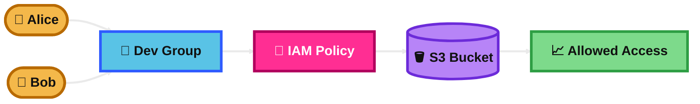
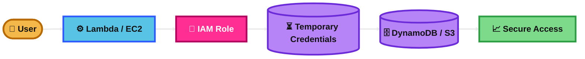
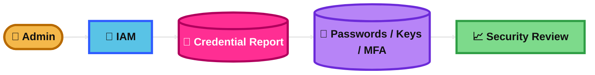
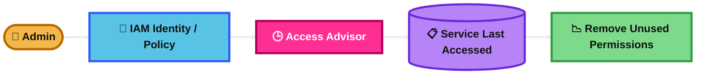

## IAM users, groups, and policies

### What is it?
IAM users are identities for people or workloads that need to access AWS.

IAM groups are collections of IAM users. You use groups to manage permissions for many users at once.

IAM policies are JSON permission documents. They define what actions are allowed or denied on which AWS resources.

### How it works?
You create a user when someone or something needs AWS access.

You place users into groups like Admins, Developers, or ReadOnly.

Then you attach policies to users, groups, or roles. AWS checks those policies every time a request is made.

### Use Case
A company has 20 developers who need read-only access to S3 and CloudWatch.

Instead of attaching the same permissions to each user one by one, you create a Developers group and attach one policy to the group.

### Exam Tip
Look for clues like human access, team-based permissions, or JSON permissions.

If the question says many users need the same access, think groups.

Trap: do not choose the root user for daily work. Also, for AWS services like EC2 or Lambda, roles are usually better than long-term IAM user access keys.

### Visual Mermaid

## IAM Roles for services

### What is it?
An IAM role is an AWS identity with permissions, but it does not have long-term credentials like a password or access keys.

AWS services can assume a role to get temporary credentials and act on your behalf.

### How it works?
You create a role and attach permissions to it.

You trust a service such as EC2, Lambda, or ECS to assume that role.

When the service runs, AWS gives it temporary credentials. The service uses those temporary credentials to call other AWS services securely.

### Use Case
A Lambda function needs to read from DynamoDB and write logs to CloudWatch.

You attach an IAM role to the Lambda function instead of storing access keys in code.

### Exam Tip
Look for clues like temporary credentials, service needs permission, avoid hardcoded keys, or AWS resource calling another AWS service.

This is often the best answer for security because it removes long-term credentials.

Trap: do not use an IAM user with access keys inside EC2, Lambda, or containers when a role can be used instead.

### Visual Mermaid

## IAM Credential Report

### What is it?
IAM Credential Report is an account-level report about IAM user credentials.

It shows things like password status, access keys, MFA status, and credential age.

### How it works?
You generate the report for the AWS account.

AWS produces a downloadable report that lists IAM users and the state of their credentials.

You review it to find risky items like old access keys, users without MFA, or unused passwords.

### Use Case
A security team wants to check which IAM users do not have MFA enabled and which users still have old active access keys.

The credential report gives that view quickly.

### Exam Tip
Look for clues like audit IAM users, check MFA, find old access keys, or review credential status across the account.

This is a security and compliance tool.

Trap: it is about credential status, not detailed API activity. It also focuses on IAM users, not service roles.

### Visual Mermaid

## IAM Access Advisor (Service Last Accessed data)

### What is it?
IAM Access Advisor shows when an IAM user, group, role, or policy last accessed AWS services.

It helps you find unused permissions so you can reduce access and apply least privilege.

### How it works?
AWS tracks service last accessed information for supported services.

You review that data to see which services were used and which were not used.

Then you remove unnecessary permissions from policies.

### Use Case
An admin sees that a role has permissions for S3, EC2, RDS, and Redshift.

Access Advisor shows the role only used S3 and EC2. The admin can review and remove the unused RDS and Redshift permissions.

### Exam Tip
Look for clues like least privilege, remove unused permissions, review service usage, or find what access was actually used.

This is a strong answer when the goal is permission cleanup.

Trap: this is not the same as CloudTrail. CloudTrail is for detailed API logging and investigation. Also, not every service or action has last accessed data support.

### Visual Mermaid

## Summary Table

| Topic | What It Is | How It Works | Best Use Case | Exam Trigger |
|---|---|---|---|---|
| IAM users, groups, and policies | Identities for people/workloads, collections of users, and JSON permissions | Create users, place them in groups, attach policies, AWS evaluates permissions on requests | Many human users need managed access | Human access, team permissions, same access for many users |
| IAM Roles for services | Temporary-permission identity for AWS services | Service assumes a role and gets temporary credentials | EC2, Lambda, ECS need to call AWS services securely | Avoid hardcoded keys, temporary credentials, service-to-service access |
| IAM Credential Report | Account-wide report of IAM user credential status | Generate report and review passwords, keys, MFA, and age | Security audit of IAM users | Check MFA, old access keys, password status, compliance |
| IAM Access Advisor (Service Last Accessed data) | Shows which AWS services were last used by an identity or policy | Review service usage data and remove unused permissions | Least-privilege cleanup | Remove unused permissions, service last accessed, permission review |
