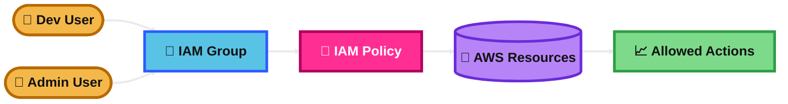
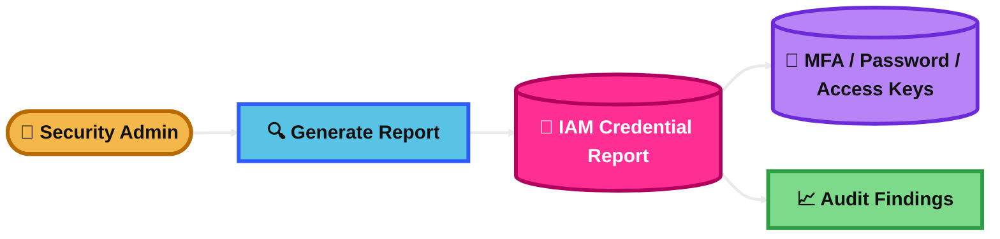
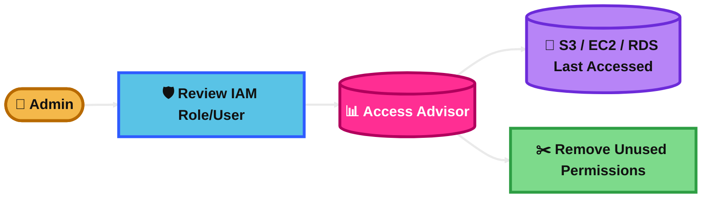

## IAM users, groups, and policies

IAM users are identities for real people or apps that need long-term AWS access.

IAM groups are collections of users. You use groups to give the same permissions to many users at once.

IAM policies are JSON permission documents. They decide what actions are allowed or denied on which AWS resources.

### Key Use Case
Use IAM users for individual people who need AWS access, and use groups plus policies to manage permissions in a clean way.

### Practical Scenario
A company has developers, admins, and auditors.

You create IAM users for each employee, put developers into a `Developers` group, and attach a policy that allows EC2 and CloudWatch access but not billing access.

### Exam Tip / Trigger
Look for clues like:
- “employee access”
- “permission management for many users”
- “least privilege”
- “attach permissions once and reuse”

Trap: do not give the same policy one by one to many users if a group can do it better. Also, for AWS services, the exam usually wants a role, not an IAM user.

### Difference Comparison
**IAM Users/Groups/Policies vs IAM Roles**

IAM users are usually for people or applications needing long-term credentials.

IAM roles are usually for temporary access and are commonly assumed by AWS services, applications, or federated identities.

### Memory Hook
**Users are people, groups organize people, policies define power.**

### Mermaid Diagram

## IAM Roles for services

An IAM role is a set of permissions that can be assumed temporarily.

For AWS services, a role lets the service act on your behalf without storing permanent access keys.

### Key Use Case
Use IAM roles when an AWS service such as EC2, Lambda, or ECS needs permission to access other AWS services.

### Practical Scenario
An EC2 instance needs to read files from S3.

Instead of storing access keys on the server, you attach an IAM role to the EC2 instance. AWS provides temporary credentials automatically.

### Exam Tip / Trigger
Look for clues like:
- “temporary credentials”
- “avoid hardcoded access keys”
- “EC2 needs access to S3”
- “Lambda writes to DynamoDB”
- “service needs permission to call another service”

Trap: if the question mentions an AWS service accessing another AWS service, the answer is usually an IAM role, not an IAM user with access keys.

### Difference Comparison
**IAM Roles for services vs IAM Users**

IAM roles use temporary credentials and are safer for workloads running in AWS.

IAM users use long-term credentials and are better for human users or special legacy cases.

### Memory Hook
**Services assume roles, people usually use users.**

### Mermaid Diagram

## IAM Credential Report

The IAM Credential Report is an account-level report about IAM users and their credentials.

It shows details such as whether a user has a password, access keys, MFA enabled, key rotation status, and last password use.

### Key Use Case
Use it to audit IAM user security and find weak or unused credentials.

### Practical Scenario
A security team wants to find users without MFA and users with old access keys.

They generate the IAM Credential Report and quickly review which accounts need cleanup.

### Exam Tip / Trigger
Look for clues like:
- “audit IAM users”
- “check MFA status”
- “find old access keys”
- “review password usage”
- “security/compliance report for IAM credentials”

Trap: this report focuses on credential hygiene. It does not tell you which AWS services a user actually used recently.

### Difference Comparison
**IAM Credential Report vs IAM Access Advisor**

Credential Report tells you about credential status such as password, access key age, and MFA.

Access Advisor tells you which services were accessed and when they were last accessed.

### Memory Hook
**Credential Report checks login safety, not service activity.**

### Mermaid Diagram

## IAM Access Advisor (Service Last Accessed data)

IAM Access Advisor shows which AWS services a user, group, or role has permission to access and when those services were last accessed.

It helps you remove permissions that are not being used.

### Key Use Case
Use it for permission cleanup and least-privilege reviews.

### Practical Scenario
An admin wants to reduce a role’s permissions.

They check Access Advisor and see the role has not used DynamoDB or Redshift access for months, so those permissions can be removed.

### Exam Tip / Trigger
Look for clues like:
- “last accessed”
- “unused permissions”
- “least privilege”
- “permission review”
- “find services not used recently”

Trap: Access Advisor is about service usage visibility. It is not mainly about password age, MFA, or access key rotation.

### Difference Comparison
**IAM Access Advisor vs IAM Credential Report**

Access Advisor shows service usage history, such as whether S3 or EC2 was accessed.

Credential Report shows security details for IAM user credentials, such as MFA enabled, password age, and access key age.

### Memory Hook
**Access Advisor answers: what did they actually use?**

### Mermaid Diagram

## Summary Table

| Topic | What It Is | Best Use Case | Similar Service / Confusion | Exam Trigger | Memory Hook |
|---|---|---|---|---|---|
| IAM users, groups, and policies | IAM identities, collections of identities, and permission documents | Managing permissions for employees and teams | Often confused with IAM roles | Employee access, least privilege, reusable permissions | Users are people, groups organize people, policies define power |
| IAM Roles for services | Temporary permissions assumed by AWS services | Let EC2, Lambda, ECS, etc. access AWS securely | Commonly confused with IAM users | Avoid hardcoded keys, service-to-service access, temporary credentials | Services assume roles, people usually use users |
| IAM Credential Report | Report about IAM user credential security status | Audit MFA, passwords, and access key age | Often confused with Access Advisor | MFA check, old access keys, password use, security audit | Credential Report checks login safety, not service activity |
| IAM Access Advisor (Service Last Accessed data) | Shows which services were used and when last accessed | Remove unused permissions and enforce least privilege | Often confused with Credential Report | Last accessed, unused permissions, least privilege review | Access Advisor answers: what did they actually use? |