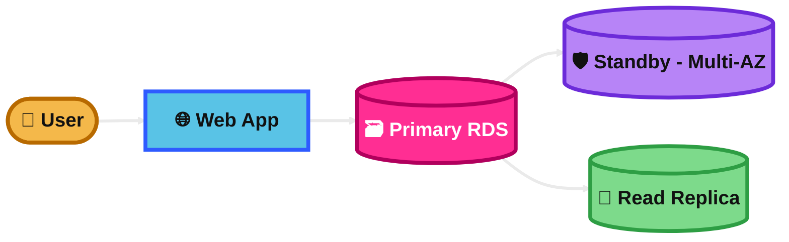
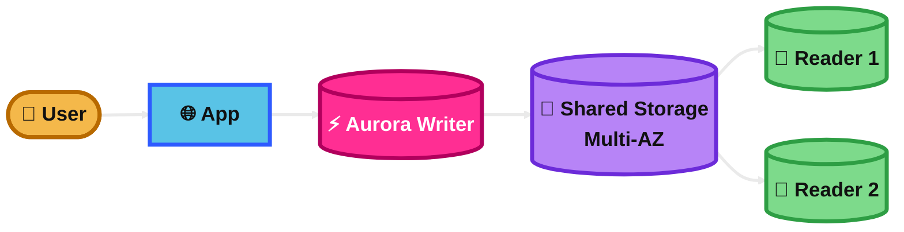
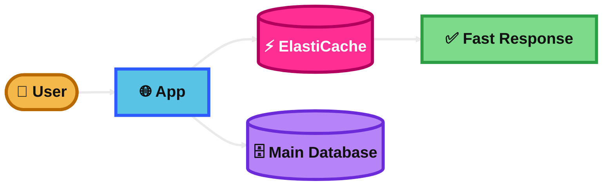
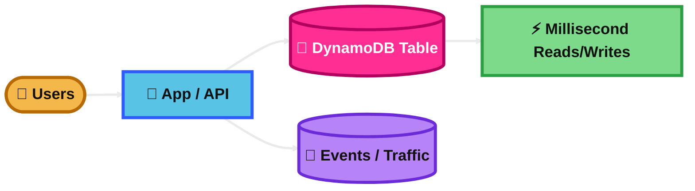
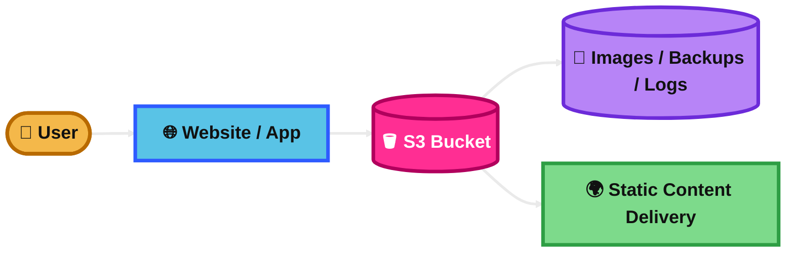
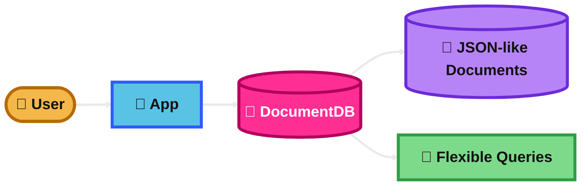
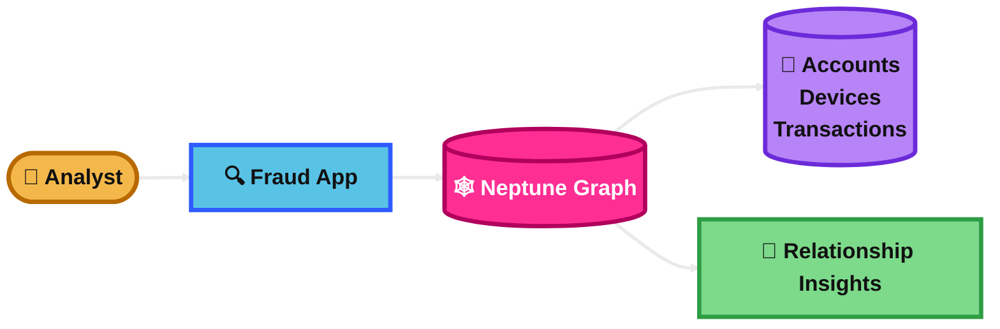
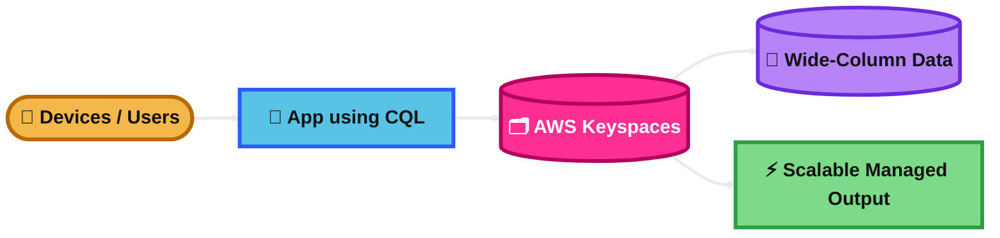
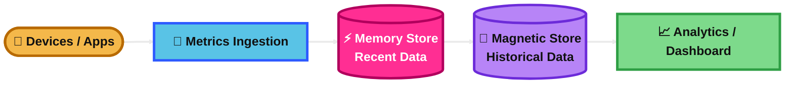

## Amazon RDS

### What is it?
Amazon RDS is a managed relational database service.

It supports engines like MySQL, PostgreSQL, MariaDB, Oracle, and SQL Server.

Use it when your app needs SQL, joins, transactions, and structured data.

### How it works?
You create a DB instance and AWS manages backups, patching, monitoring, and failover options.

You connect to it like a normal relational database.

For high availability, use Multi-AZ.

For read scaling, use Read Replicas.

### Visual Mermaid

## Amazon Aurora

### What is it?
Amazon Aurora is a high-performance managed relational database built for the cloud.

It is compatible with MySQL or PostgreSQL.

It is part of the RDS family, but it is usually faster and more highly available than standard RDS engines.

### How it works?
Aurora separates compute and storage.

Its storage automatically grows, and data is replicated across multiple Availability Zones.

You can use reader instances to scale reads.

Aurora is designed for fast failover and strong durability.

### Visual Mermaid

## Amazon ElastiCache

### What is it?
Amazon ElastiCache is a managed in-memory caching service.

It supports Redis and Memcached.

It is used to make applications faster by storing frequently accessed data in memory.

### How it works?
Your app checks the cache first.

If the data is there, it returns very fast.

If not, the app reads from the main database, returns the result, and can store it in the cache for next time.

Redis also supports features like replication, persistence, and pub/sub.

### Visual Mermaid

## Amazon DynamoDB

### What is it?
Amazon DynamoDB is a fully managed serverless NoSQL database.

It is designed for key-value and document data.

It provides very fast performance at massive scale.

### How it works?
You store items in tables.

Each item is identified by a primary key.

You design around access patterns, usually with a partition key and sometimes a sort key.

It scales automatically and is built for very low latency.

### Visual Mermaid

## Amazon S3

### What is it?
Amazon S3 is an object storage service.

It is used to store files, backups, images, videos, logs, and static website content.

It is highly durable and can scale very easily.

### How it works?
You store objects inside buckets.

Each object has data, metadata, and a key.

You can use storage classes, versioning, lifecycle rules, encryption, and replication.

Apps access S3 over HTTP-based APIs.

### Visual Mermaid

## Amazon DocumentDB

### What is it?
Amazon DocumentDB is a managed document database service.

It is designed for JSON-like document data and is compatible with MongoDB workloads.

It is useful when your application stores flexible schema data.

### How it works?
You store data as documents instead of rows and columns.

Your app reads and writes document records using document-style queries.

AWS handles the infrastructure, backups, and scaling operations.

It is easier to manage than running your own MongoDB servers.

### Visual Mermaid

## Amazon Neptune

### What is it?
Amazon Neptune is a managed graph database service.

It is built for data with many relationships.

It is useful when the connection between records is the most important part of the problem.

### How it works?
Data is stored as nodes and relationships, or as graph triples.

Queries are optimized for relationship traversal.

This makes it fast for finding paths, connected items, recommendations, and network patterns.

### Visual Mermaid

## AWS Keyspaces

### What is it?
AWS Keyspaces is a fully managed, serverless Apache Cassandra-compatible database service.

It is a good fit for wide-column NoSQL workloads that need high scale and low operational work.

Use it when you want Cassandra behavior on AWS without managing clusters, nodes, patching, or replication.

### How it works?
You create keyspaces and tables, then your application uses Cassandra Query Language (CQL) and existing Cassandra drivers to read and write data.

AWS handles the infrastructure behind the service.

It automatically manages storage, scales throughput, and replicates data across multiple Availability Zones for high availability.

You can use on-demand capacity for unpredictable traffic or provisioned capacity for more predictable workloads.

### Visual Mermaid

## Amazon Timestream

### What is it?
Amazon Timestream is a fully managed, serverless time-series database.

It is built for data that changes over time, such as IoT sensor readings, application metrics, and monitoring data.

Use it when the main value is storing and analyzing time-stamped events at scale.

### How it works?
Applications write time-series records into Timestream.

Recent data is kept in the memory store for fast queries.

Older data moves to the magnetic store for lower-cost historical analysis.

You set retention rules, and AWS manages the storage lifecycle, scaling, and infrastructure.

### Visual Mermaid

## Summary Table

| Topic | What It Is | How It Works | Best Use Case | Exam Trigger |
|---|---|---|---|---|
| Amazon RDS | Managed relational database | DB instance with SQL engine, backups, Multi-AZ, Read Replicas | Traditional apps needing SQL and transactions | SQL, relational, ACID, Multi-AZ, Read Replica |
| Amazon Aurora | Cloud-native high-performance relational DB in the RDS family | Shared storage across AZs, writer plus readers, fast failover | Need managed MySQL/PostgreSQL with better performance and HA | High-performance relational, MySQL/PostgreSQL compatible, cloud-native |
| Amazon ElastiCache | Managed in-memory cache | App checks cache before database | Speed up repeated reads, sessions, hot data | Caching, low latency, Redis, Memcached, reduce DB load |
| Amazon DynamoDB | Serverless NoSQL key-value/document database | Items in tables using primary keys, auto scaling | Massive scale apps with very low latency | NoSQL, serverless, millisecond latency, huge traffic |
| Amazon S3 | Object storage service | Objects stored in buckets with storage classes and lifecycle rules | Backups, static files, logs, data lake | Object storage, static website, durable, cheap storage |
| Amazon DocumentDB | Managed document database | Stores JSON-like documents with flexible schema | Product catalogs, content apps, document-style workloads | Document DB, MongoDB compatibility, flexible schema |
| Amazon Neptune | Managed graph database | Stores nodes and relationships for graph queries | Fraud detection, recommendations, social graphs | Highly connected data, graph, relationship traversal |