## Amazon CloudWatch Metrics

CloudWatch metrics are time-series numbers about performance and health.

They show values such as CPU, latency, request count, or errors. AWS services publish many metrics automatically, and your app can publish custom metrics too.

### Key Use Case
Use metrics to measure system behavior over time and build alarms and dashboards.

### Practical Scenario
Your EC2 CPU goes above 80% during peak hours. You watch the CPUUtilization metric and create an alarm to react fast.

### Exam Tip / Trigger
Look for words like **CPU**, **latency**, **throughput**, **error count**, **graph**, or **threshold**.

Trap: metrics are **numbers**, not raw log lines and not API audit history.

### Difference Comparison
Compared with **CloudWatch Logs**: Metrics are numeric data points. Logs are detailed text records.

### Memory Hook
**Metrics = numbers you can graph.**

### Mermaid Diagram
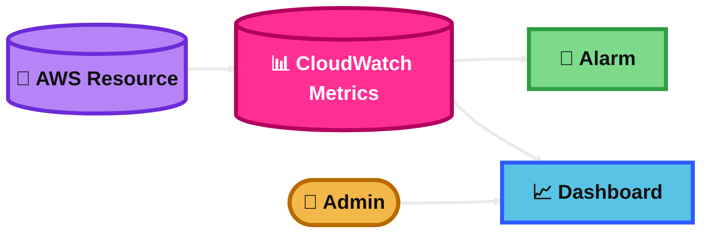
## CloudWatch Metric Streams

Metric Streams continuously push CloudWatch metrics out of CloudWatch with near-real-time delivery.

This is useful when another tool or data lake wants the metrics without polling CloudWatch again and again.

### Key Use Case
Use Metric Streams when you want continuous export of metrics to destinations such as S3 or partner tools.

### Practical Scenario
A company sends AWS metrics to an external observability platform. Metric Streams pushes the data automatically instead of the platform pulling metrics by API.

### Exam Tip / Trigger
Look for **near-real-time metric delivery**, **stream metrics out**, **low-latency export**, or **avoid polling APIs**.

Trap: if the question is about querying metrics inside CloudWatch, Metric Streams is not the answer.

### Difference Comparison
Compared with **CloudWatch Metrics**: Metrics are the data itself. Metric Streams is the export pipeline for that data.

### Memory Hook
**Metric Streams = metrics on the move.**

### Mermaid Diagram
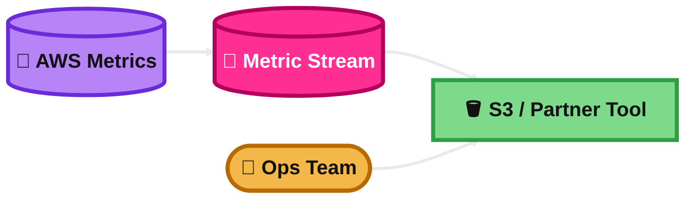
## CloudWatch Logs

CloudWatch Logs stores and centralizes log data from AWS services, applications, and servers.

You can search logs, filter them, retain them, and use them for troubleshooting.

### Key Use Case
Use CloudWatch Logs when you need a managed place for application logs, OS logs, and service logs.

### Practical Scenario
Your app on ECS throws random 500 errors. You open CloudWatch Logs and inspect the application log group to find the exception.

### Exam Tip / Trigger
Look for **log files**, **error messages**, **application logs**, **centralized logs**, or **search log events**.

Trap: CloudWatch Logs is not for compliance history of API calls. That is CloudTrail.

### Difference Comparison
Compared with **CloudTrail**: CloudWatch Logs stores operational logs. CloudTrail records AWS API activity.

### Memory Hook
**Logs = text evidence of what happened inside the workload.**

### Mermaid Diagram
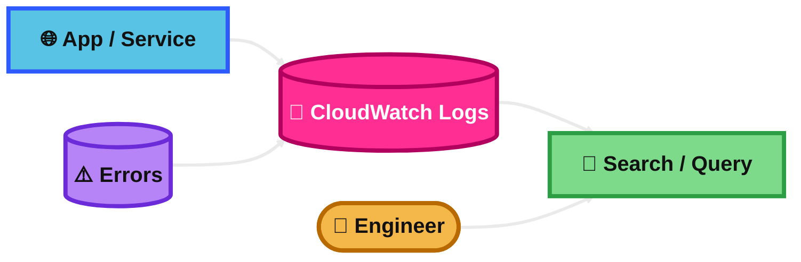
## CloudWatch Logs Insights

Logs Insights is the query tool for CloudWatch Logs.

It lets you interactively search, filter, parse, and aggregate log data to find problems faster.

### Key Use Case
Use Logs Insights when you need to query logs and answer questions like “Which API path failed most often?”

### Practical Scenario
You query the last 15 minutes of logs and count the top error messages during an outage.

### Exam Tip / Trigger
Look for **interactive query**, **analyze logs**, **top errors**, **parse JSON logs**, or **find patterns quickly**.

Trap: if the need is real-time forwarding of logs to another service, use subscriptions instead.

### Difference Comparison
Compared with **Contributor Insights**: Logs Insights is ad hoc querying. Contributor Insights is for top contributors and high-cardinality patterns.

### Memory Hook
**Logs Insights = SQL-like thinking for logs.**

### Mermaid Diagram
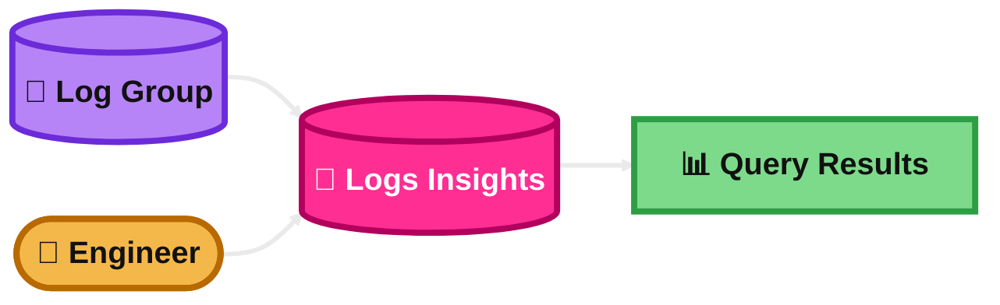
## CloudWatch Logs – S3 Export

CloudWatch Logs can export log data to Amazon S3 in batch form.

This is useful for archive, long-term storage, or later processing outside CloudWatch.

### Key Use Case
Use S3 export when you want older log data stored in S3 for retention or offline analysis.

### Practical Scenario
A company keeps one year of logs in S3 for audit and cost reasons after first collecting them in CloudWatch Logs.

### Exam Tip / Trigger
Look for **export logs to S3**, **archive logs**, or **batch export**.

Trap: S3 export is **not** the best answer for real-time streaming.

### Difference Comparison
Compared with **CloudWatch Logs Subscriptions**: S3 export is batch style. Subscriptions are near real time.

### Memory Hook
**S3 Export = send old logs to cheaper long-term storage.**

### Mermaid Diagram
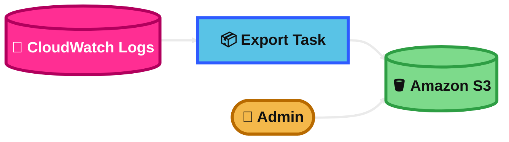
## CloudWatch Logs Subscriptions

A subscription filter sends log events from CloudWatch Logs to another service in near real time.

Common targets are Lambda, Kinesis Data Streams, and Firehose.

### Key Use Case
Use subscriptions when logs must be processed immediately after ingestion.

### Practical Scenario
Every new application error log is streamed to Lambda, which enriches the record and sends alerts to another system.

### Exam Tip / Trigger
Look for **real-time log processing**, **stream logs**, **send logs to Lambda/Kinesis/Firehose**, or **log pipeline**.

Trap: do not choose S3 export when the question says real time.

### Difference Comparison
Compared with **CloudWatch Logs – S3 Export**: Subscriptions are near real time. S3 export is batch.

### Memory Hook
**Subscriptions = logs keep moving after arrival.**

### Mermaid Diagram
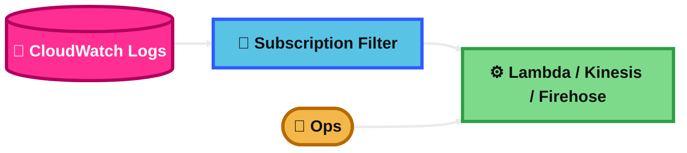
## CloudWatch Logs Aggregation Multi-Account & Multi Region

This is about centralizing logs from many accounts and Regions into one monitoring location.

It helps large organizations simplify security, operations, and log analysis.

### Key Use Case
Use log centralization when an organization wants one central account to store and analyze logs from many accounts and Regions.

### Practical Scenario
A company with separate dev, test, and prod accounts copies logs from all Regions into one security account.

### Exam Tip / Trigger
Look for **central logging**, **AWS Organizations**, **multiple accounts**, **multiple Regions**, or **single place for logs**.

Trap: this is different from only viewing data across accounts in the console.

### Difference Comparison
Compared with **CloudWatch cross-account observability**: Log centralization copies logs into a central destination. Cross-account observability lets you view and troubleshoot across linked accounts.

### Memory Hook
**Aggregation = bring scattered logs to one home.**

### Mermaid Diagram
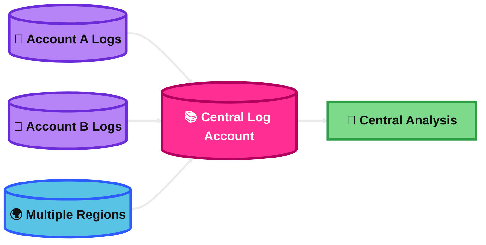
## CloudWatch Logs for EC2

For EC2, CloudWatch does not magically read your instance log files unless you send them.

You normally install the unified CloudWatch agent on the EC2 instance to push OS and app logs.

### Key Use Case
Use the CloudWatch agent when you want EC2 system logs or application logs in CloudWatch Logs.

### Practical Scenario
You install the agent on Linux EC2 instances to send `/var/log/messages` and app logs to CloudWatch Logs.

### Exam Tip / Trigger
Look for **collect logs from EC2**, **install agent**, **OS logs**, or **application logs from instance**.

Trap: default EC2 monitoring gives metrics, not your custom log files.

### Difference Comparison
Compared with **EC2 default CloudWatch metrics**: default metrics show numbers like CPU. The agent sends logs and extra system metrics.

### Memory Hook
**EC2 logs need an agent.**

### Mermaid Diagram
```mermaid
%%{init: {'theme':'base','themeVariables': {
  'background':'#0B0F19',
  'primaryTextColor':'#111111',
  'secondaryTextColor':'#111111',
  'tertiaryTextColor':'#111111',
  'lineColor':'#EAEAEA',
  'fontSize':'20px'
}}}%%
flowchart LR
    E[(🖥️ EC2 Instance)]:::data --> G[🧰 CloudWatch Agent]:::app
    G --> L[(📝 CloudWatch Logs)]:::core
    L --> Q[🔎 View / Query]:::dash

    classDef user fill:#F4B84A,stroke:#B86A00,stroke-width:4px,color:#111111,font-weight:bold;
    classDef app fill:#59C3E6,stroke:#2E5BFF,stroke-width:4px,color:#111111,font-weight:bold;
    classDef data fill:#B784F7,stroke:#6C2BD9,stroke-width:4px,color:#111111,font-weight:bold;
    classDef core fill:#FF2E93,stroke:#B1005D,stroke-width:4px,color:#FFFFFF,font-weight:bold;
    classDef dash fill:#7DDA8B,stroke:#2E9E44,stroke-width:4px,color:#111111,font-weight:bold;

    linkStyle 0,1,2,3 stroke:#EAEAEA,stroke-width:3px;
```
## CloudWatch Alarm

A CloudWatch alarm watches a metric or math expression and changes state when a threshold is crossed.

It can notify you or trigger automated actions.

### Key Use Case
Use alarms to react automatically when performance, errors, or capacity cross safe limits.

### Practical Scenario
If CPU stays above 80% for 5 minutes, an alarm sends an SNS notification or helps drive scaling action.

### Exam Tip / Trigger
Look for **threshold**, **alert**, **notify**, **breach**, or **automatic action**.

Trap: alarms react to metrics. They do not inspect AWS API history.

### Difference Comparison
Compared with **EventBridge**: Alarm is threshold-based on metrics. EventBridge is event-pattern based.

### Memory Hook
**Alarm = metric crosses line, action starts.**

### Mermaid Diagram
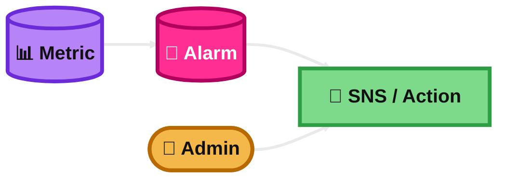
## CloudWatch Network Synthetic Monitor

For exam prep, think **CloudWatch Synthetics canaries**.

It runs scheduled tests against endpoints and APIs to check availability and latency even when no real users are active.

### Key Use Case
Use synthetic monitoring when you want proactive tests from the outside in.

### Practical Scenario
A canary hits your login page every minute and alerts you if the page becomes slow or breaks.

### Exam Tip / Trigger
Look for **simulate user**, **test endpoint on a schedule**, **check availability before customers notice**, or **canary**.

Trap: this is not based on real user traffic.

### Difference Comparison
Compared with **CloudWatch Alarm**: Synthetics actively tests the system. Alarms react to existing metrics.

### Memory Hook
**Synthetic = fake user, real warning.**

### Mermaid Diagram
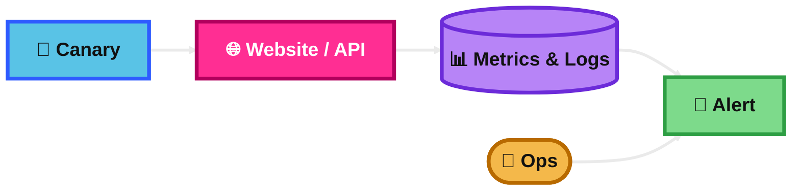
## Amazon EventBridge

EventBridge is a serverless event bus.

It receives events from AWS services, applications, or SaaS tools and routes them to targets.

### Key Use Case
Use EventBridge for event-driven architectures where one event should trigger one or more actions.

### Practical Scenario
When a new order event is published, EventBridge routes it to billing, shipping, and analytics services.

### Exam Tip / Trigger
Look for **event bus**, **route events**, **match event pattern**, **serverless integration**, or **decouple producers and consumers**.

Trap: EventBridge is not a queue for long processing backlogs.

### Difference Comparison
Compared with **SNS**: EventBridge uses rich event patterns and routing rules. SNS is simpler pub/sub fanout.

### Memory Hook
**EventBridge = if event matches, send it.**

### Mermaid Diagram
```mermaid
%%{init: {'theme':'base','themeVariables': {
  'background':'#0B0F19',
  'primaryTextColor':'#111111',
  'secondaryTextColor':'#111111',
  'tertiaryTextColor':'#111111',
  'lineColor':'#EAEAEA',
  'fontSize':'20px'
}}}%%
flowchart LR
    P[(📨 Events)]:::data --> B[(🚌 EventBridge Bus)]:::core
    B --> T1[⚙️ Lambda]:::dash
    B --> T2[📬 SNS / SQS]:::dash
    U([👤 Architect]):::user --> B

    classDef user fill:#F4B84A,stroke:#B86A00,stroke-width:4px,color:#111111,font-weight:bold;
    classDef app fill:#59C3E6,stroke:#2E5BFF,stroke-width:4px,color:#111111,font-weight:bold;
    classDef data fill:#B784F7,stroke:#6C2BD9,stroke-width:4px,color:#111111,font-weight:bold;
    classDef core fill:#FF2E93,stroke:#B1005D,stroke-width:4px,color:#FFFFFF,font-weight:bold;
    classDef dash fill:#7DDA8B,stroke:#2E9E44,stroke-width:4px,color:#111111,font-weight:bold;

    linkStyle 0,1,2,3,4 stroke:#EAEAEA,stroke-width:3px;
```
## Amazon EventBridge Rules

Rules tell EventBridge which events to match and where to send them.

A rule uses an event pattern or a schedule, then invokes targets.

### Key Use Case
Use rules to filter events and connect them to the right target service.

### Practical Scenario
A rule matches EC2 instance state-change events and sends only “stopped” events to a Lambda function.

### Exam Tip / Trigger
Look for **event pattern**, **target**, **match specific eventName/source/detail**, or **scheduled rule**.

Trap: for new scheduled workloads, AWS recommends **EventBridge Scheduler** over legacy scheduled rules.

### Difference Comparison
Compared with **EventBridge Scheduler**: Rules match events and can do legacy schedules. Scheduler is better for dedicated large-scale scheduling.

### Memory Hook
**Rule = match + target.**

### Mermaid Diagram
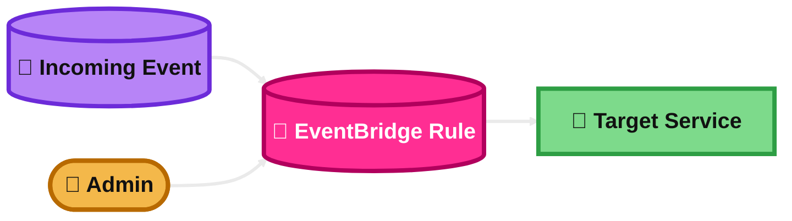
## Amazon EventBridge – Schema Registry

Schema Registry stores and organizes event schemas.

It helps developers understand event structure and generate code bindings faster.

### Key Use Case
Use Schema Registry when teams build event-driven apps and want the event format documented and reusable.

### Practical Scenario
A team consumes order events and downloads code bindings so developers can parse the event safely in code.

### Exam Tip / Trigger
Look for **event schema**, **discover event structure**, **generate code bindings**, or **developer productivity**.

Trap: Schema Registry does not route events. EventBridge rules do that.

### Difference Comparison
Compared with **EventBridge Rules**: Schema Registry describes event shape. Rules route events.

### Memory Hook
**Schema Registry = event contract book.**

### Mermaid Diagram
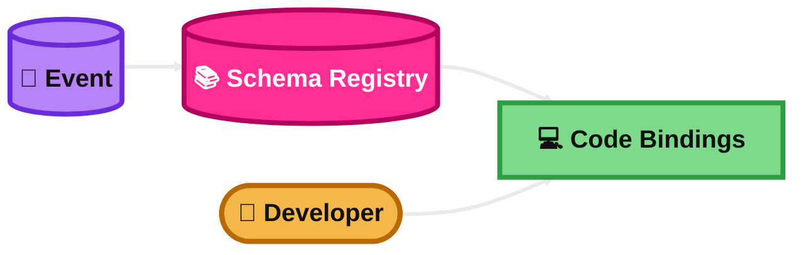
## Amazon EventBridge – Resource-based Policy

EventBridge often needs permission to call or write to its targets.

For Lambda, SNS, SQS, and CloudWatch Logs, this is commonly done with resource-based policies.

### Key Use Case
Use resource-based policies when EventBridge must be allowed to invoke a target resource it does not own by default.

### Practical Scenario
An EventBridge rule should invoke a Lambda function. The Lambda function policy must allow EventBridge to invoke it.

### Exam Tip / Trigger
Look for **allow EventBridge to invoke target**, **permission denied**, or **target needs policy**.

Trap: not every target uses a resource-based policy. Some targets use an IAM role instead.

### Difference Comparison
Compared with **IAM role for EventBridge target**: Lambda/SNS/SQS/CloudWatch Logs often use resource-based policies. Kinesis or Step Functions commonly use an IAM role.

### Memory Hook
**Resource policy = target says “EventBridge, you may call me.”**

### Mermaid Diagram
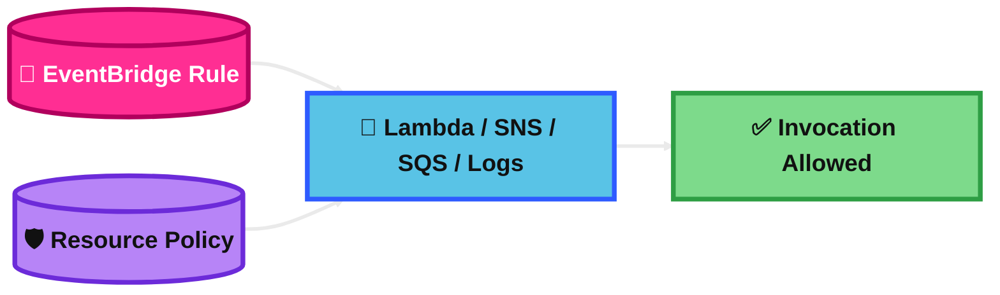
## CloudWatch Container Insights

Container Insights gives deeper monitoring for container platforms such as ECS and EKS.

It collects and summarizes metrics and logs for clusters, services, tasks, pods, and more.

### Key Use Case
Use Container Insights when you need detailed visibility into container workloads.

### Practical Scenario
An EKS cluster has random performance issues. Container Insights shows pod, node, and cluster resource usage to narrow the problem.

### Exam Tip / Trigger
Look for **ECS**, **EKS**, **container metrics**, **pod/task visibility**, or **deeper than default metrics**.

Trap: basic service metrics are not as detailed as Container Insights.

### Difference Comparison
Compared with **CloudWatch Application Insights**: Container Insights focuses on container platforms. Application Insights focuses on app-level health across resources.

### Memory Hook
**Container Insights = deep eyes inside clusters.**

### Mermaid Diagram
```mermaid
%%{init: {'theme':'base','themeVariables': {
  'background':'#0B0F19',
  'primaryTextColor':'#111111',
  'secondaryTextColor':'#111111',
  'tertiaryTextColor':'#111111',
  'lineColor':'#EAEAEA',
  'fontSize':'20px'
}}}%%
flowchart LR
    C[(📦 ECS / EKS Cluster)]:::data --> I[(🔍 Container Insights)]:::core
    I --> M[📊 Cluster / Pod Metrics]:::dash
    I --> L[📝 Container Logs]:::dash
    U([👤 SRE]):::user --> M

    classDef user fill:#F4B84A,stroke:#B86A00,stroke-width:4px,color:#111111,font-weight:bold;
    classDef app fill:#59C3E6,stroke:#2E5BFF,stroke-width:4px,color:#111111,font-weight:bold;
    classDef data fill:#B784F7,stroke:#6C2BD9,stroke-width:4px,color:#111111,font-weight:bold;
    classDef core fill:#FF2E93,stroke:#B1005D,stroke-width:4px,color:#FFFFFF,font-weight:bold;
    classDef dash fill:#7DDA8B,stroke:#2E9E44,stroke-width:4px,color:#111111,font-weight:bold;

    linkStyle 0,1,2,3,4 stroke:#EAEAEA,stroke-width:3px;
```
## CloudWatch Lambda Insights

Lambda Insights gives deeper visibility into Lambda runtime behavior.

It collects system-level metrics and diagnostics such as memory, CPU time, cold starts, and worker shutdown information.

### Key Use Case
Use Lambda Insights when default Lambda metrics are not enough for troubleshooting.

### Practical Scenario
A Lambda function times out sometimes. Lambda Insights helps show memory pressure and cold-start patterns.

### Exam Tip / Trigger
Look for **deeper Lambda troubleshooting**, **cold starts**, **system-level metrics**, or **diagnostic information**.

Trap: basic Lambda metrics like Invocations and Errors are helpful, but less detailed.

### Difference Comparison
Compared with **default Lambda CloudWatch metrics**: Lambda Insights goes deeper into runtime and diagnostics.

### Memory Hook
**Lambda Insights = x-ray vision for Lambda runtime.**

### Mermaid Diagram
```mermaid
%%{init: {'theme':'base','themeVariables': {
  'background':'#0B0F19',
  'primaryTextColor':'#111111',
  'secondaryTextColor':'#111111',
  'tertiaryTextColor':'#111111',
  'lineColor':'#EAEAEA',
  'fontSize':'20px'
}}}%%
flowchart LR
    F[(🧠 Lambda Function)]:::data --> I[(🔍 Lambda Insights)]:::core
    I --> M[📊 CPU / Memory / Cold Starts]:::dash
    I --> L[📝 Diagnostic Logs]:::dash
    U([👤 Developer]):::user --> M

    classDef user fill:#F4B84A,stroke:#B86A00,stroke-width:4px,color:#111111,font-weight:bold;
    classDef app fill:#59C3E6,stroke:#2E5BFF,stroke-width:4px,color:#111111,font-weight:bold;
    classDef data fill:#B784F7,stroke:#6C2BD9,stroke-width:4px,color:#111111,font-weight:bold;
    classDef core fill:#FF2E93,stroke:#B1005D,stroke-width:4px,color:#FFFFFF,font-weight:bold;
    classDef dash fill:#7DDA8B,stroke:#2E9E44,stroke-width:4px,color:#111111,font-weight:bold;

    linkStyle 0,1,2,3,4 stroke:#EAEAEA,stroke-width:3px;
```
## CloudWatch Contributor Insights

Contributor Insights finds the top contributors behind metrics or log patterns.

This is very useful for high-cardinality data such as top IPs, noisy hosts, or hottest DynamoDB keys.

### Key Use Case
Use Contributor Insights when you need to know **who** or **what** is contributing most to a problem.

### Practical Scenario
A web app has too many 429 errors. Contributor Insights shows the IP addresses or API paths generating most of them.

### Exam Tip / Trigger
Look for **top talkers**, **top contributors**, **high-cardinality analysis**, or **most frequent offenders**.

Trap: this is not the same as general free-form log querying.

### Difference Comparison
Compared with **Logs Insights**: Contributor Insights highlights top contributors automatically. Logs Insights is manual querying.

### Memory Hook
**Contributor Insights = who is causing most of the noise.**

### Mermaid Diagram
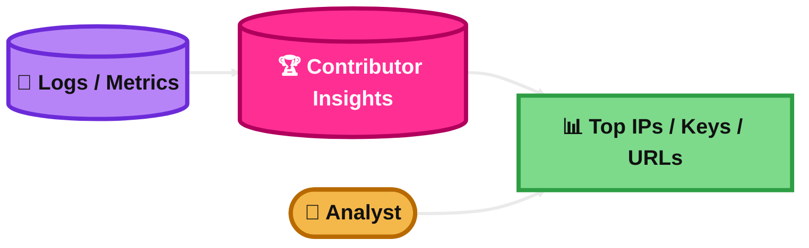
## CloudWatch Application Insights

Application Insights helps monitor applications and their underlying AWS resources.

It can identify important metrics, logs, and alarms for the application stack and help detect common problems.

### Key Use Case
Use Application Insights when you want faster setup of application observability across multiple related resources.

### Practical Scenario
A multi-tier app on EC2, SQL Server, load balancers, and queues needs one monitoring view with recommended alarms and dashboards.

### Exam Tip / Trigger
Look for **application-level monitoring**, **auto-detect problems**, **recommended monitors**, or **observe many related resources together**.

Trap: this is broader than Lambda Insights or Container Insights.

### Difference Comparison
Compared with **CloudWatch Lambda Insights**: Application Insights monitors the wider application stack. Lambda Insights is only for Lambda runtime depth.

### Memory Hook
**Application Insights = app health with guided setup.**

### Mermaid Diagram
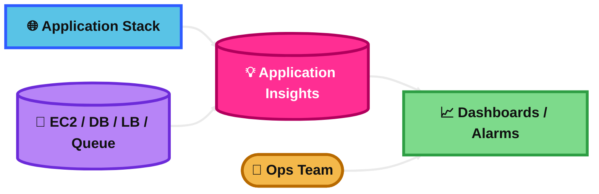
## CloudWatch Insights and Operational Visibility

This is the big-picture use of CloudWatch.

CloudWatch gives operational visibility through metrics, logs, alarms, dashboards, and cross-account observability.

### Key Use Case
Use CloudWatch when you want one place to watch system health, troubleshoot, and see trends.

### Practical Scenario
An operations team uses dashboards, alarms, metrics, and logs in CloudWatch to monitor a production platform across several AWS accounts.

### Exam Tip / Trigger
Look for **operational visibility**, **single monitoring pane**, **dashboards**, **metrics + logs + alarms**, or **observability across accounts**.

Trap: CloudWatch is about monitoring operations, not long-term API governance history.

### Difference Comparison
Compared with **CloudTrail**: CloudWatch is for monitoring health and performance. CloudTrail is for auditing AWS API activity.

### Memory Hook
**CloudWatch = see how the system is doing now.**

### Mermaid Diagram
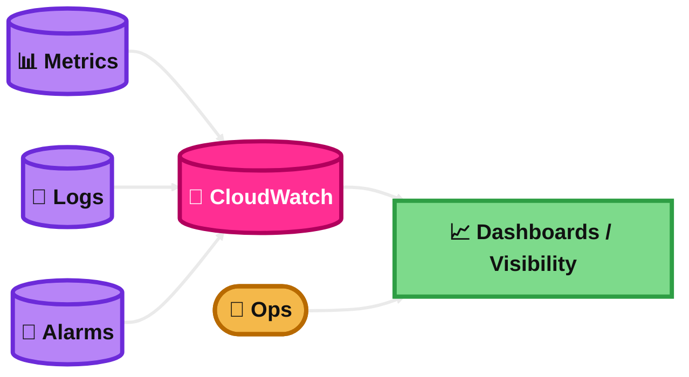
## AWS CloudTrail

CloudTrail records AWS API activity in your account.

It is mainly for auditing, governance, security investigation, and compliance.

### Key Use Case
Use CloudTrail when you need to know **who did what, when, and from where** in AWS.

### Practical Scenario
A security team checks who deleted an S3 bucket policy and which IAM user or role made the API call.

### Exam Tip / Trigger
Look for **API calls**, **audit trail**, **governance**, **compliance**, **who changed this**, or **console/CLI/SDK action history**.

Trap: CloudTrail is not for CPU or memory monitoring.

### Difference Comparison
Compared with **CloudWatch**: CloudTrail records AWS API actions. CloudWatch monitors performance and health.

### Memory Hook
**CloudTrail = audit trail of AWS actions.**

### Mermaid Diagram
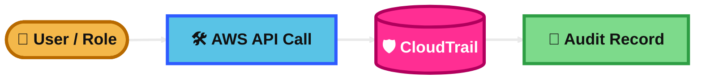
## AWS CloudTrail Events

CloudTrail events are the records CloudTrail captures.

For exam thinking, know the four types: **management**, **data**, **network activity**, and **Insights** events.

### Key Use Case
Use CloudTrail events to track specific actions and understand what kind of activity happened.

### Practical Scenario
You enable data events to record object-level S3 access, not just bucket configuration changes.

### Exam Tip / Trigger
Look for **management events**, **data events**, **S3 object access**, **Lambda invoke access**, or **VPC endpoint activity**.

Trap: management events are logged by default, but data events are not.

### Difference Comparison
Compared with **CloudTrail event history**: event history is a view of recent management events. “CloudTrail events” is the broader concept and includes more event types.

### Memory Hook
**CloudTrail events = the raw audit records.**

### Mermaid Diagram
```mermaid
%%{init: {'theme':'base','themeVariables': {
  'background':'#0B0F19',
  'primaryTextColor':'#111111',
  'secondaryTextColor':'#111111',
  'tertiaryTextColor':'#111111',
  'lineColor':'#EAEAEA',
  'fontSize':'20px'
}}}%%
flowchart LR
    A[🛠️ AWS Activity]:::app --> E[(📜 CloudTrail Events)]:::core
    E --> M[⚙️ Management]:::dash
    E --> D[📦 Data]:::dash
    E --> N[🌐 Network]:::dash
    E --> I[💡 Insights]:::dash

    classDef user fill:#F4B84A,stroke:#B86A00,stroke-width:4px,color:#111111,font-weight:bold;
    classDef app fill:#59C3E6,stroke:#2E5BFF,stroke-width:4px,color:#111111,font-weight:bold;
    classDef data fill:#B784F7,stroke:#6C2BD9,stroke-width:4px,color:#111111,font-weight:bold;
    classDef core fill:#FF2E93,stroke:#B1005D,stroke-width:4px,color:#FFFFFF,font-weight:bold;
    classDef dash fill:#7DDA8B,stroke:#2E9E44,stroke-width:4px,color:#111111,font-weight:bold;

    linkStyle 0,1,2,3,4 stroke:#EAEAEA,stroke-width:3px;
```
## CloudTrail Insights

CloudTrail Insights looks for unusual API call patterns or error patterns.

It helps detect spikes or odd behavior compared with normal baseline activity.

### Key Use Case
Use CloudTrail Insights when you want anomaly-style detection for AWS API activity.

### Practical Scenario
A sudden spike in failed `DeleteBucketPolicy` or many unusual write API calls appears. CloudTrail Insights flags it as unusual.

### Exam Tip / Trigger
Look for **unusual API activity**, **spike in API calls**, **abnormal error rate**, or **deviation from baseline**.

Trap: this is not the same as GuardDuty threat detection.

### Difference Comparison
Compared with **GuardDuty**: CloudTrail Insights spots unusual CloudTrail API patterns. GuardDuty is a broader threat-detection service.

### Memory Hook
**Insights = CloudTrail notices weird behavior.**

### Mermaid Diagram
```mermaid
%%{init: {'theme':'base','themeVariables': {
  'background':'#0B0F19',
  'primaryTextColor':'#111111',
  'secondaryTextColor':'#111111',
  'tertiaryTextColor':'#111111',
  'lineColor':'#EAEAEA',
  'fontSize':'20px'
}}}%%
flowchart LR
    E[(📜 CloudTrail Events)]:::data --> I[(💡 CloudTrail Insights)]:::core
    I --> A[🚨 Unusual Activity Alert]:::dash
    U([👤 Security Team]):::user --> A

    classDef user fill:#F4B84A,stroke:#B86A00,stroke-width:4px,color:#111111,font-weight:bold;
    classDef app fill:#59C3E6,stroke:#2E5BFF,stroke-width:4px,color:#111111,font-weight:bold;
    classDef data fill:#B784F7,stroke:#6C2BD9,stroke-width:4px,color:#111111,font-weight:bold;
    classDef core fill:#FF2E93,stroke:#B1005D,stroke-width:4px,color:#FFFFFF,font-weight:bold;
    classDef dash fill:#7DDA8B,stroke:#2E9E44,stroke-width:4px,color:#111111,font-weight:bold;

    linkStyle 0,1,2 stroke:#EAEAEA,stroke-width:3px;
```
## CloudTrail Events Retention

CloudTrail Event History gives the last **90 days** of management events in a Region.

For longer retention, use a **trail** to S3 or use **CloudTrail Lake event data stores**.

### Key Use Case
Use trails or CloudTrail Lake when the business needs audit history longer than 90 days.

### Practical Scenario
An auditor asks for 2 years of AWS API history. Event History is not enough, so the company stores trail logs long term or uses CloudTrail Lake.

### Exam Tip / Trigger
Look for **90 days**, **long-term audit**, **keep events for years**, or **query stored audit data**.

Trap: Event History alone is not a long-term archive.

### Difference Comparison
Compared with **CloudTrail Event History**: Event History is recent and limited. Trails/S3 and CloudTrail Lake are for longer retention.

### Memory Hook
**90 days free view, longer needs storage choice.**

### Mermaid Diagram
```mermaid
%%{init: {'theme':'base','themeVariables': {
  'background':'#0B0F19',
  'primaryTextColor':'#111111',
  'secondaryTextColor':'#111111',
  'tertiaryTextColor':'#111111',
  'lineColor':'#EAEAEA',
  'fontSize':'20px'
}}}%%
flowchart LR
    E[(📜 CloudTrail Events)]:::data --> H[🕒 90-Day Event History]:::app
    E --> S[(🪣 Trail to S3 / Lake)]:::core
    S --> Y[📚 Long-Term Retention]:::dash

    classDef user fill:#F4B84A,stroke:#B86A00,stroke-width:4px,color:#111111,font-weight:bold;
    classDef app fill:#59C3E6,stroke:#2E5BFF,stroke-width:4px,color:#111111,font-weight:bold;
    classDef data fill:#B784F7,stroke:#6C2BD9,stroke-width:4px,color:#111111,font-weight:bold;
    classDef core fill:#FF2E93,stroke:#B1005D,stroke-width:4px,color:#FFFFFF,font-weight:bold;
    classDef dash fill:#7DDA8B,stroke:#2E9E44,stroke-width:4px,color:#111111,font-weight:bold;

    linkStyle 0,1,2,3 stroke:#EAEAEA,stroke-width:3px;
```
## Amazon EventBridge – Intercept API Calls

EventBridge can react to AWS API calls that CloudTrail records.

This is how you build near-real-time automation when an AWS action happens.

### Key Use Case
Use EventBridge + CloudTrail when an AWS API call should trigger a workflow immediately.

### Practical Scenario
Whenever someone stops an EC2 instance, EventBridge matches the CloudTrail API event and invokes Lambda to create a ticket.

### Exam Tip / Trigger
Look for **react to API call**, **AWS API Call via CloudTrail**, **automate after console/CLI action**, or **eventName match**.

Trap: Config is for compliance state. EventBridge + CloudTrail is for event-driven reaction.

### Difference Comparison
Compared with **AWS Config**: EventBridge + CloudTrail reacts to an API event. Config evaluates whether the resulting resource state is compliant.

### Memory Hook
**CloudTrail sees it, EventBridge acts on it.**

### Mermaid Diagram
```mermaid
%%{init: {'theme':'base','themeVariables': {
  'background':'#0B0F19',
  'primaryTextColor':'#111111',
  'secondaryTextColor':'#111111',
  'tertiaryTextColor':'#111111',
  'lineColor':'#EAEAEA',
  'fontSize':'20px'
}}}%%
flowchart LR
    A[🛠️ AWS API Call]:::app --> T[(🛡️ CloudTrail)]:::data
    T --> E[(🚌 EventBridge Rule)]:::core
    E --> L[⚙️ Lambda / Action]:::dash

    classDef user fill:#F4B84A,stroke:#B86A00,stroke-width:4px,color:#111111,font-weight:bold;
    classDef app fill:#59C3E6,stroke:#2E5BFF,stroke-width:4px,color:#111111,font-weight:bold;
    classDef data fill:#B784F7,stroke:#6C2BD9,stroke-width:4px,color:#111111,font-weight:bold;
    classDef core fill:#FF2E93,stroke:#B1005D,stroke-width:4px,color:#FFFFFF,font-weight:bold;
    classDef dash fill:#7DDA8B,stroke:#2E9E44,stroke-width:4px,color:#111111,font-weight:bold;

    linkStyle 0,1,2,3 stroke:#EAEAEA,stroke-width:3px;
```
## AWS Config

AWS Config records resource configuration state and changes over time.

It helps with compliance, change tracking, and understanding resource relationships.

### Key Use Case
Use AWS Config when you need to know whether AWS resources are configured according to policy.

### Practical Scenario
A company wants to know which S3 buckets are public and how bucket settings changed over time.

### Exam Tip / Trigger
Look for **configuration history**, **compliance**, **resource relationships**, **noncompliant resource**, or **track config changes**.

Trap: Config is not the best answer for raw API audit history. That is CloudTrail.

### Difference Comparison
Compared with **CloudTrail**: Config tracks resource configuration state over time. CloudTrail tracks API activity.

### Memory Hook
**Config = what the resource looks like, and whether it is compliant.**

### Mermaid Diagram
```mermaid
%%{init: {'theme':'base','themeVariables': {
  'background':'#0B0F19',
  'primaryTextColor':'#111111',
  'secondaryTextColor':'#111111',
  'tertiaryTextColor':'#111111',
  'lineColor':'#EAEAEA',
  'fontSize':'20px'
}}}%%
flowchart LR
    R[(🧩 AWS Resource)]:::data --> C[(📚 AWS Config)]:::core
    C --> H[🕒 History]:::dash
    C --> P[✅ Compliance View]:::dash
    U([👤 Auditor]):::user --> P

    classDef user fill:#F4B84A,stroke:#B86A00,stroke-width:4px,color:#111111,font-weight:bold;
    classDef app fill:#59C3E6,stroke:#2E5BFF,stroke-width:4px,color:#111111,font-weight:bold;
    classDef data fill:#B784F7,stroke:#6C2BD9,stroke-width:4px,color:#111111,font-weight:bold;
    classDef core fill:#FF2E93,stroke:#B1005D,stroke-width:4px,color:#FFFFFF,font-weight:bold;
    classDef dash fill:#7DDA8B,stroke:#2E9E44,stroke-width:4px,color:#111111,font-weight:bold;

    linkStyle 0,1,2,3,4 stroke:#EAEAEA,stroke-width:3px;
```
## AWS Config Rules

Config Rules evaluate whether resources comply with required settings.

You can use AWS managed rules or create custom rules.

### Key Use Case
Use Config Rules when you want automatic compliance checks against standards.

### Practical Scenario
A rule checks that EBS volumes are encrypted. Any unencrypted volume becomes noncompliant.

### Exam Tip / Trigger
Look for **must be encrypted**, **required tags**, **must not be public**, or **continuous compliance check**.

Trap: Config Rules evaluate compliance. They do not directly fix problems unless remediation is also configured.

### Difference Comparison
Compared with **Security Hub**: Config Rules evaluate resource configuration compliance. Security Hub aggregates and prioritizes security findings from multiple services.

### Memory Hook
**Config Rule = policy check for AWS resources.**

### Mermaid Diagram
```mermaid
%%{init: {'theme':'base','themeVariables': {
  'background':'#0B0F19',
  'primaryTextColor':'#111111',
  'secondaryTextColor':'#111111',
  'tertiaryTextColor':'#111111',
  'lineColor':'#EAEAEA',
  'fontSize':'20px'
}}}%%
flowchart LR
    R[(🧩 Resource Config)]:::data --> Q[(📏 Config Rule)]:::core
    Q --> C[✅ Compliant]:::dash
    Q --> N[❌ Noncompliant]:::dash

    classDef user fill:#F4B84A,stroke:#B86A00,stroke-width:4px,color:#111111,font-weight:bold;
    classDef app fill:#59C3E6,stroke:#2E5BFF,stroke-width:4px,color:#111111,font-weight:bold;
    classDef data fill:#B784F7,stroke:#6C2BD9,stroke-width:4px,color:#111111,font-weight:bold;
    classDef core fill:#FF2E93,stroke:#B1005D,stroke-width:4px,color:#FFFFFF,font-weight:bold;
    classDef dash fill:#7DDA8B,stroke:#2E9E44,stroke-width:4px,color:#111111,font-weight:bold;

    linkStyle 0,1,2,3 stroke:#EAEAEA,stroke-width:3px;
```
## AWS Config Resource

An AWS Config resource is a supported AWS resource that Config records.

Config creates a **configuration item** for that resource, which is a point-in-time view of its attributes, relationships, and state.

### Key Use Case
Use Config resource history when you need to inspect how one resource changed over time.

### Practical Scenario
You open the Config record for one security group and see past inbound rule changes and related ENIs.

### Exam Tip / Trigger
Look for **configuration item**, **point-in-time view**, **resource relationships**, or **history for one resource**.

Trap: this is different from a CloudTrail event, which records an action instead of the full resource configuration state.

### Difference Comparison
Compared with **CloudTrail event**: Config resource history shows resource state. CloudTrail shows the action that changed it.

### Memory Hook
**Config resource = snapshot of resource truth at a moment in time.**

### Mermaid Diagram
```mermaid
%%{init: {'theme':'base','themeVariables': {
  'background':'#0B0F19',
  'primaryTextColor':'#111111',
  'secondaryTextColor':'#111111',
  'tertiaryTextColor':'#111111',
  'lineColor':'#EAEAEA',
  'fontSize':'20px'
}}}%%
flowchart LR
    R[(🧩 AWS Resource)]:::data --> C[(📄 Configuration Item)]:::core
    C --> A[🔗 Attributes / Relationships]:::dash
    C --> H[🕒 Change History]:::dash

    classDef user fill:#F4B84A,stroke:#B86A00,stroke-width:4px,color:#111111,font-weight:bold;
    classDef app fill:#59C3E6,stroke:#2E5BFF,stroke-width:4px,color:#111111,font-weight:bold;
    classDef data fill:#B784F7,stroke:#6C2BD9,stroke-width:4px,color:#111111,font-weight:bold;
    classDef core fill:#FF2E93,stroke:#B1005D,stroke-width:4px,color:#FFFFFF,font-weight:bold;
    classDef dash fill:#7DDA8B,stroke:#2E9E44,stroke-width:4px,color:#111111,font-weight:bold;

    linkStyle 0,1,2,3 stroke:#EAEAEA,stroke-width:3px;
```
## AWS Config Rules – Remediations

Config remediation lets you fix noncompliant resources after a rule finds a problem.

It commonly uses AWS Systems Manager Automation documents to perform the fix.

### Key Use Case
Use remediation when compliance should lead to corrective action automatically or with approval.

### Practical Scenario
A rule detects an unencrypted EBS volume. Remediation runs an automation document or other approved action to fix or contain the issue.

### Exam Tip / Trigger
Look for **auto-fix noncompliant resources**, **remediate after rule evaluation**, or **Systems Manager Automation with Config**.

Trap: a Config Rule alone only detects. Remediation is the fixing step.

### Difference Comparison
Compared with **AWS Config Rules**: Rules evaluate. Remediations act.

### Memory Hook
**Rule finds it, remediation fixes it.**

### Mermaid Diagram
```mermaid
%%{init: {'theme':'base','themeVariables': {
  'background':'#0B0F19',
  'primaryTextColor':'#111111',
  'secondaryTextColor':'#111111',
  'tertiaryTextColor':'#111111',
  'lineColor':'#EAEAEA',
  'fontSize':'20px'
}}}%%
flowchart LR
    Q[(📏 Config Rule)]:::app --> N[❌ Noncompliant]:::data
    N --> R[(🛠️ Remediation)]:::core
    R --> F[✅ Fixed State]:::dash

    classDef user fill:#F4B84A,stroke:#B86A00,stroke-width:4px,color:#111111,font-weight:bold;
    classDef app fill:#59C3E6,stroke:#2E5BFF,stroke-width:4px,color:#111111,font-weight:bold;
    classDef data fill:#B784F7,stroke:#6C2BD9,stroke-width:4px,color:#111111,font-weight:bold;
    classDef core fill:#FF2E93,stroke:#B1005D,stroke-width:4px,color:#FFFFFF,font-weight:bold;
    classDef dash fill:#7DDA8B,stroke:#2E9E44,stroke-width:4px,color:#111111,font-weight:bold;

    linkStyle 0,1,2,3 stroke:#EAEAEA,stroke-width:3px;
```
## AWS Config Rules – Notifications

AWS Config can send SNS notifications about configuration changes and compliance results.

This helps teams know when something changed or became noncompliant.

### Key Use Case
Use notifications when operations or security teams must be alerted about compliance or config changes.

### Practical Scenario
A compliance team gets an SNS message each time a critical resource becomes noncompliant with a Config rule.

### Exam Tip / Trigger
Look for **notify on compliance change**, **SNS notification**, **config change alert**, or **noncompliant resource message**.

Trap: notifications inform you. They do not automatically remediate unless remediation is also configured.

### Difference Comparison
Compared with **Config remediation**: Notifications tell you. Remediation fixes.

### Memory Hook
**Notification = Config speaks up.**

### Mermaid Diagram
```mermaid
%%{init: {'theme':'base','themeVariables': {
  'background':'#0B0F19',
  'primaryTextColor':'#111111',
  'secondaryTextColor':'#111111',
  'tertiaryTextColor':'#111111',
  'lineColor':'#EAEAEA',
  'fontSize':'20px'
}}}%%
flowchart LR
    C[(📚 AWS Config)]:::core --> E[❗ Change / Compliance Event]:::app
    E --> S[(📣 SNS Topic)]:::dash
    U([👤 Ops / Audit Team]):::user --> S

    classDef user fill:#F4B84A,stroke:#B86A00,stroke-width:4px,color:#111111,font-weight:bold;
    classDef app fill:#59C3E6,stroke:#2E5BFF,stroke-width:4px,color:#111111,font-weight:bold;
    classDef data fill:#B784F7,stroke:#6C2BD9,stroke-width:4px,color:#111111,font-weight:bold;
    classDef core fill:#FF2E93,stroke:#B1005D,stroke-width:4px,color:#FFFFFF,font-weight:bold;
    classDef dash fill:#7DDA8B,stroke:#2E9E44,stroke-width:4px,color:#111111,font-weight:bold;

    linkStyle 0,1,2,3 stroke:#EAEAEA,stroke-width:3px;
```
## CloudWatch vs CloudTrail vs Config

These three are commonly confused on the exam.

Use the question clue to decide whether AWS wants **monitoring**, **audit**, or **configuration compliance**.

### Key Use Case
- **CloudWatch**: monitor performance, metrics, logs, alarms, dashboards.
- **CloudTrail**: audit AWS API actions.
- **Config**: track resource configuration and compliance.

### Practical Scenario
- CPU too high? **CloudWatch**
- Who deleted the security group rule? **CloudTrail**
- Is the security group compliant with policy? **Config**

### Exam Tip / Trigger
Look for:
- **performance / threshold / logs / dashboard** → CloudWatch
- **who did what / API call / audit** → CloudTrail
- **compliant / resource configuration / history of settings** → Config

Common trap: “resource changed” can involve all three. Ask what the question really wants: health, action history, or compliance state.

### Difference Comparison
- **CloudWatch** = operational monitoring
- **CloudTrail** = API audit history
- **Config** = resource config and compliance

### Memory Hook
**Watch = health, Trail = actions, Config = settings.**

### Mermaid Diagram
```mermaid
%%{init: {'theme':'base','themeVariables': {
  'background':'#0B0F19',
  'primaryTextColor':'#111111',
  'secondaryTextColor':'#111111',
  'tertiaryTextColor':'#111111',
  'lineColor':'#EAEAEA',
  'fontSize':'20px'
}}}%%
flowchart LR
    X[🧩 AWS Resource / User Action]:::app --> W[(👀 CloudWatch)]:::core
    X --> T[(🛡️ CloudTrail)]:::core
    X --> C[(📚 Config)]:::core
    W --> O1[📈 Health]:::dash
    T --> O2[📜 Audit]:::dash
    C --> O3[✅ Compliance]:::dash

    classDef user fill:#F4B84A,stroke:#B86A00,stroke-width:4px,color:#111111,font-weight:bold;
    classDef app fill:#59C3E6,stroke:#2E5BFF,stroke-width:4px,color:#111111,font-weight:bold;
    classDef data fill:#B784F7,stroke:#6C2BD9,stroke-width:4px,color:#111111,font-weight:bold;
    classDef core fill:#FF2E93,stroke:#B1005D,stroke-width:4px,color:#FFFFFF,font-weight:bold;
    classDef dash fill:#7DDA8B,stroke:#2E9E44,stroke-width:4px,color:#111111,font-weight:bold;

    linkStyle 0,1,2,3,4,5 stroke:#EAEAEA,stroke-width:3px;
```
## Summary Table

| Topic | What It Is | Best Use Case | Similar Service / Confusion | Exam Trigger | Memory Hook |
|---|---|---|---|---|---|
| Amazon CloudWatch Metrics | Time-series numbers about system health | Graph, monitor, alarm on performance | Confused with Logs | CPU, latency, throughput, threshold | Metrics = numbers you can graph |
| CloudWatch Metric Streams | Continuous export of metrics | Send metrics out in near real time | Confused with metrics themselves | Stream metrics, avoid polling | Metrics on the move |
| CloudWatch Logs | Managed log storage and search | Centralize app and service logs | Confused with CloudTrail | Error logs, log groups, log events | Text evidence |
| CloudWatch Logs Insights | Query engine for logs | Investigate errors fast | Confused with Contributor Insights | Query logs, parse JSON, top errors | SQL-like for logs |
| CloudWatch Logs – S3 Export | Batch export logs to S3 | Archive or offline analysis | Confused with subscriptions | Export logs, archive to S3 | Old logs to cheap storage |
| CloudWatch Logs Subscriptions | Real-time log forwarding | Send logs to Lambda/Kinesis/Firehose | Confused with S3 export | Real-time log pipeline | Logs keep moving |
| CloudWatch Logs Aggregation Multi-Account & Multi Region | Centralized org-wide log copy | One account for log analysis | Confused with cross-account observability | Central logging, many accounts/Regions | Bring logs to one home |
| CloudWatch Logs for EC2 | Sending EC2 logs via agent | Collect OS/app logs from instances | Confused with default EC2 metrics | Install agent, send instance logs | EC2 logs need an agent |
| CloudWatch Alarm | Threshold-based alert/action | Notify or automate on metric breach | Confused with EventBridge | Threshold, alarm, breach | Cross line, act |
| CloudWatch Network Synthetic Monitor | Scheduled synthetic testing with canaries | Proactive endpoint checks | Confused with alarms or real-user traffic | Canary, simulate user, availability check | Fake user, real warning |
| Amazon EventBridge | Serverless event bus | Route events to targets | Confused with SNS/SQS | Event bus, event pattern | If event matches, send it |
| Amazon EventBridge Rules | Match events and invoke targets | Filter and route events | Confused with Scheduler | Rule, pattern, target | Match + target |
| Amazon EventBridge – Schema Registry | Stores event schemas | Understand event format, generate bindings | Confused with Rules | Schema, code bindings | Event contract book |
| Amazon EventBridge – Resource-based Policy | Permission for EventBridge to invoke certain targets | Allow Lambda/SNS/SQS/Logs targets | Confused with IAM role target auth | Permission denied, allow EventBridge | Target says yes |
| CloudWatch Container Insights | Deep container observability | Monitor ECS/EKS workloads | Confused with App Insights | Cluster, pod, task metrics | Eyes inside clusters |
| CloudWatch Lambda Insights | Deep Lambda runtime visibility | Troubleshoot serverless performance | Confused with default Lambda metrics | Cold starts, memory, CPU time | X-ray for Lambda |
| CloudWatch Contributor Insights | Top-N contributor analysis | Find noisy IPs/keys/users | Confused with Logs Insights | Top talkers, hottest keys | Who causes the noise |
| CloudWatch Application Insights | App-level observability setup | Monitor whole app stack | Confused with Lambda/Container Insights | Recommended monitors, app health | Guided app health |
| CloudWatch Insights and Operational Visibility | Overall operational monitoring in CloudWatch | Dashboards, alarms, logs, metrics | Confused with CloudTrail | Operational visibility, dashboards | See system health now |
| AWS CloudTrail | AWS API audit log | Governance, forensics, compliance | Confused with CloudWatch | Who did what, API call | Audit trail |
| AWS CloudTrail Events | CloudTrail record types | Understand action categories | Confused with Event History only | Management/data/network/Insights | Raw audit records |
| CloudTrail Insights | Detects unusual API behavior | Spot anomalies in API use | Confused with GuardDuty | Unusual API rate, odd errors | Notices weird API activity |
| CloudTrail Events Retention | How long CloudTrail data is kept | Store audit data beyond 90 days | Confused with Event History | 90 days vs long-term retention | 90 days free view |
| Amazon EventBridge – Intercept API Calls | React to CloudTrail API events | Trigger automation on AWS actions | Confused with Config | AWS API Call via CloudTrail | CloudTrail sees, EventBridge acts |
| AWS Config | Tracks config state and history | Compliance and config change tracking | Confused with CloudTrail | Resource settings, compliance | What resource looks like |
| AWS Config Rules | Compliance checks | Enforce policy continuously | Confused with Security Hub | Must be encrypted/tagged/not public | Policy check |
| AWS Config Resource | Recorded resource/configuration item | Inspect one resource’s state history | Confused with CloudTrail event | Configuration item, relationships | Snapshot of truth |
| AWS Config Rules – Remediations | Fixes noncompliant resources | Auto-correct policy violations | Confused with rules alone | Auto-fix with SSM Automation | Rule finds, remediation fixes |
| AWS Config Rules – Notifications | Alerts on config/compliance changes | Tell teams something changed | Confused with remediation | SNS notification, compliance change | Config speaks up |
| CloudWatch vs CloudTrail vs Config | Comparison of monitor vs audit vs compliance | Pick the right service in scenario questions | These three are often confused | Health vs action history vs settings | Watch, Trail, Config |