## AWS Virtual Private Cloud (VPC)

### What is it?
A VPC is your private network inside AWS.

It lets you choose your IP range, create subnets, add route tables, and control how resources talk to each other or to the internet.

### How it works?
You create a VPC with a CIDR block.

Inside it, you place resources like EC2, RDS, and load balancers into subnets.

Then you connect the VPC to other networks by using things like an Internet Gateway, VPN, Direct Connect, Transit Gateway, or VPC endpoints.

### Use Case
A company runs a web app in AWS.

It puts web servers, app servers, and databases in one VPC, then separates them with public and private subnets.

### Exam Tip
If the question says “logically isolated network,” “choose IP ranges,” or “control routing inside AWS,” think VPC.

Trap: a VPC is the whole network. A subnet is only a smaller part inside it.

### Visual Mermaid
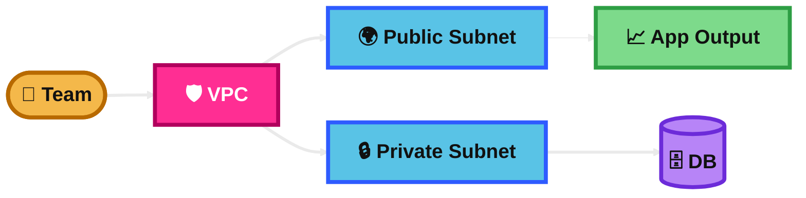
## AWS Subnets

### What is it?
A subnet is a smaller network inside a VPC.

It belongs to one Availability Zone.

### How it works?
You split the VPC CIDR into smaller CIDR blocks.

A subnet becomes public if its route table sends internet traffic to an Internet Gateway.

A subnet is private if it does not have that route.

### Use Case
Put web servers in public subnets.

Put app servers and databases in private subnets.

### Exam Tip
If the question mentions “one Availability Zone,” “public subnet,” or “private subnet,” think subnet design.

Trap: a subnet is not automatically public just because an EC2 has a public IP. The route table must also point to an Internet Gateway.

### Visual Mermaid
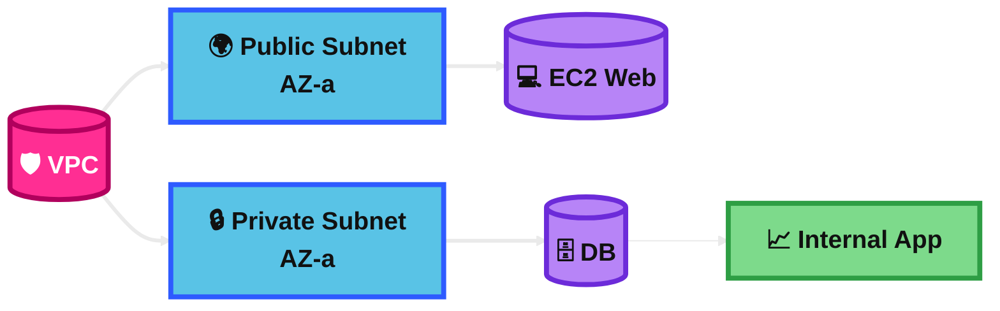
## AWS Internet Gateway

### What is it?
An Internet Gateway (IGW) connects a VPC to the internet.

It is highly available and managed by AWS.

### How it works?
You attach the IGW to a VPC.

Then public subnet route tables send internet-bound traffic to the IGW.

Instances also need a public IPv4 address or Elastic IP to use IPv4 internet access.

### Use Case
A public web server in a public subnet needs users on the internet to reach it.

### Exam Tip
If the question says “publicly accessible EC2,” “internet-facing,” or “public subnet route to 0.0.0.0/0,” think Internet Gateway.

Trap: attaching an IGW alone does not make instances public. You still need correct routes and public IPs.

### Visual Mermaid

## NAT Gateway and Internet Gateway

### What is it?
These two are often used together.

The Internet Gateway gives direct internet access to public resources.

The NAT Gateway gives outbound internet access to private resources.

### How it works?
A NAT Gateway is placed in a public subnet and uses the Internet Gateway for internet access.

Private subnet route tables point internet-bound traffic to the NAT Gateway.

The NAT Gateway sends traffic out, but outside systems cannot start a connection back to the private instances.

### Use Case
App servers in private subnets need software updates from the internet, but must stay private.

### Exam Tip
If the question says “private subnet needs outbound internet only,” the answer is usually NAT Gateway.

If it says “internet users must reach the server directly,” the answer is Internet Gateway.

Trap: NAT Gateway does not allow inbound internet connections to private instances.

### Visual Mermaid
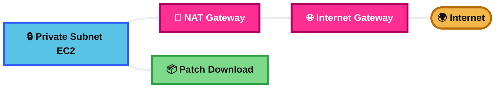
## Virtual Private Gateway (VPN)

### What is it?
A Virtual Private Gateway (VGW) is the AWS-side VPN endpoint for a Site-to-Site VPN.

It attaches to one VPC.

### How it works?
Your on-premises router connects over IPsec tunnels to AWS.

On the AWS side, the connection terminates on the VGW.

The VPC route tables then send on-premises traffic to that VGW.

### Use Case
A company wants secure connectivity from its office network to one VPC over the internet.

### Exam Tip
If the question says “VPN endpoint on the AWS side” and the design is for one VPC, think Virtual Private Gateway.

Trap: for many VPCs and hub-and-spoke connectivity, Transit Gateway is usually better.

### Visual Mermaid

## NAT Instance

### What is it?
A NAT Instance is an EC2 instance that performs NAT for private subnets.

It is the older, self-managed option.

### How it works?
You launch an EC2 instance in a public subnet.

You disable source/destination checks on it.

Private subnets route outbound traffic to that EC2 instance, which then sends traffic out through the Internet Gateway.

### Use Case
A legacy environment needs custom NAT behavior, special software, or deep control over the instance.

### Exam Tip
If the question asks for the most managed, scalable, and highly available answer, do not pick NAT Instance.

Trap: AWS usually prefers NAT Gateway over NAT Instance for the exam unless the question clearly needs custom instance-level control.

### Visual Mermaid
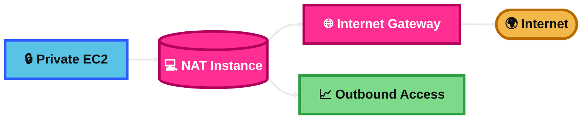
## AWS NAT Gateway

### What is it?
A NAT Gateway is an AWS-managed NAT service.

It is the exam-favorite answer for private subnet outbound internet access.

### How it works?
You place it in a public subnet and associate an Elastic IP for public internet access.

Private subnets route internet-bound traffic to it.

For resilience, AWS recommends one NAT Gateway per Availability Zone and routing each private subnet to the NAT Gateway in the same AZ.

### Use Case
Private EC2 instances download patches, call public APIs, or pull packages without becoming publicly reachable.

### Exam Tip
Look for these clues: “managed,” “high availability,” “private subnet outbound only,” “no inbound internet,” and “minimal admin effort.”

Trap: NAT Gateway adds hourly and data processing charges, so VPC endpoints can be cheaper for S3 or DynamoDB access.

### Visual Mermaid
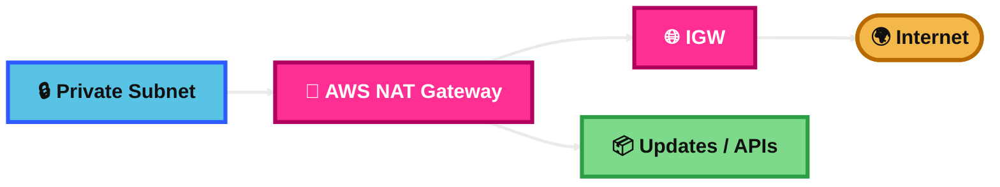
## Stateless vs Stateful Firewalls

### What is it?
Stateful firewalls remember connection state.

Stateless firewalls check each packet by rule, without remembering earlier traffic.

### How it works?
In AWS, Security Groups are stateful.

NACLs are stateless.

AWS Network Firewall can use both stateless and stateful inspection.

### Use Case
Use stateful filtering for normal instance protection.

Use stateless rules when you want strict subnet-level allow and deny controls.

### Exam Tip
If the question says “response traffic is automatically allowed,” think stateful.

If it says “must allow both inbound and outbound explicitly,” think stateless.

Trap: many exam questions try to confuse Security Groups and NACLs here.

### Visual Mermaid
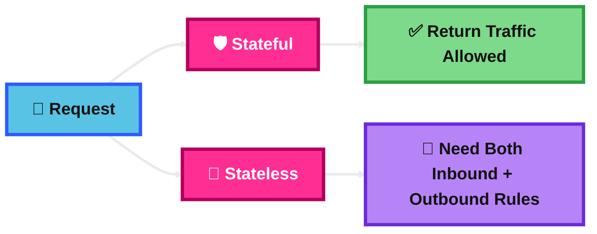
## Network Access Control List (NACL)

### What is it?
A NACL is a subnet-level firewall for inbound and outbound traffic.

It supports allow and deny rules.

### How it works?
Each subnet is associated with a NACL.

Rules are evaluated by rule number, and the first matching rule wins.

Because it is stateless, you must allow both the request and the response traffic.

### Use Case
A company wants to block a specific bad IP range at the subnet level.

### Exam Tip
If the question says “subnet-level,” “explicit deny,” or “block a range of IPs,” think NACL.

Trap: Security Groups do not support deny rules. NACLs do.

### Visual Mermaid
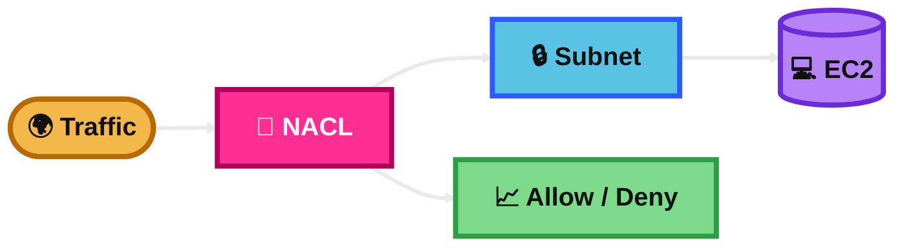
## VPC Peering

### What is it?
VPC Peering is a private network connection between two VPCs.

It lets them talk using private IP addresses.

### How it works?
You create a peering connection between two VPCs.

Then you update route tables so traffic for the peer VPC CIDR goes through the peering connection.

### Use Case
Two small applications in different VPCs need simple private communication.

### Exam Tip
If the question says “connect two VPCs privately” and the design is simple one-to-one, think VPC Peering.

Trap: VPC Peering is not transitive. If A is peered with B, and B with C, A cannot automatically reach C.

### Visual Mermaid
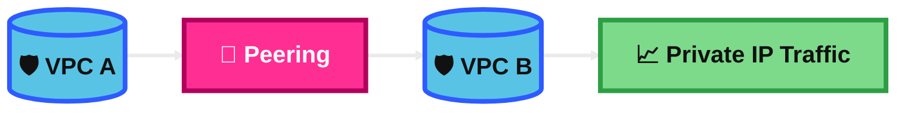
## VPC Endpoint

### What is it?
A VPC endpoint lets your VPC reach supported AWS services privately.

This avoids going through the public internet.

### How it works?
Gateway endpoints are mainly for S3 and DynamoDB.

Interface endpoints use AWS PrivateLink and create private ENIs in your subnets for supported services.

### Use Case
Private EC2 instances need to access S3 without using a NAT Gateway or Internet Gateway.

### Exam Tip
If the question says “private access to AWS service,” “no internet,” “keep traffic on AWS network,” or “reduce NAT cost for S3/DynamoDB,” think VPC endpoint.

Trap: gateway endpoints are not for every service. For most other services, use interface endpoints.

### Visual Mermaid
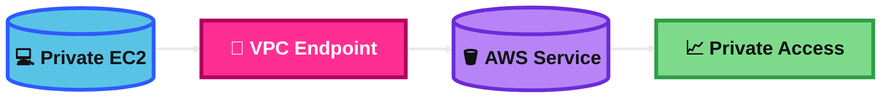
## VPC Flow Logs

### What is it?
VPC Flow Logs capture metadata about IP traffic in your VPC.

They help with troubleshooting and security analysis.

### How it works?
You enable flow logs for a VPC, subnet, or ENI.

Logs can be sent to CloudWatch Logs, S3, or Firehose.

The logs show traffic details like source, destination, port, protocol, and accept or reject status.

### Use Case
A team wants to know why a server cannot connect to another server or whether traffic is being rejected.

### Exam Tip
If the question says “analyze traffic,” “troubleshoot dropped connections,” or “see accepted/rejected network traffic,” think VPC Flow Logs.

Trap: Flow Logs are not packet payload capture. For deep packet inspection, think Traffic Mirroring or Network Firewall.

### Visual Mermaid
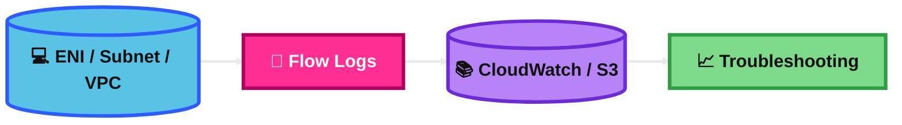
## AWS Site-to-Site VPN

### What is it?
AWS Site-to-Site VPN gives encrypted connectivity between your on-premises network and AWS over the internet.

### How it works?
You create a VPN connection between your customer gateway device and AWS.

AWS uses either a Virtual Private Gateway or a Transit Gateway on the AWS side.

Each VPN connection has two tunnels for redundancy.

### Use Case
A company wants a quick hybrid connection from its data center to AWS without waiting for a dedicated circuit.

### Exam Tip
If the question says “encrypted connection over the internet,” “hybrid,” or “backup to Direct Connect,” think Site-to-Site VPN.

Trap: Site-to-Site VPN is usually faster to set up, but Direct Connect is better when the question wants dedicated private connectivity and more consistent performance.

### Visual Mermaid
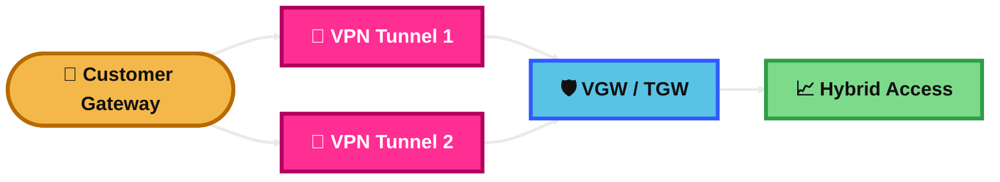
## Direct Connect (DX) and Direct Connect Gateway

### What is it?
Direct Connect is a dedicated private network connection from your site to AWS.

A Direct Connect Gateway helps extend that connection to multiple VPCs, including across Regions.

### How it works?
You provision a Direct Connect connection at a DX location.

Then you create a virtual interface.

If you use a Direct Connect Gateway, you can connect the DX link to multiple VPCs through virtual private gateways, or to a Transit Gateway with a transit VIF.

### Use Case
A company needs more consistent, private hybrid connectivity than internet-based VPN.

### Exam Tip
If the question says “dedicated network,” “private connectivity,” “more consistent performance,” or “multiple VPCs across Regions,” think Direct Connect plus Direct Connect Gateway.

Trap: Direct Connect is not encrypted by default. If the question requires encryption, add VPN or another encryption method.

### Visual Mermaid
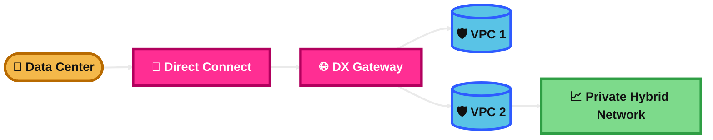
## Transit Gateway

### What is it?
Transit Gateway (TGW) is a central hub for connecting many VPCs and on-premises networks.

It is the scalable answer for hub-and-spoke networking.

### How it works?
You attach VPCs, VPNs, and Direct Connect connectivity to the TGW.

The TGW then routes traffic between attachments at Layer 3 using route tables.

### Use Case
A company with many AWS accounts and many VPCs wants a central networking hub instead of many peering connections.

### Exam Tip
If the question says “many VPCs,” “hub and spoke,” “simplify network management,” or “avoid full mesh peering,” think Transit Gateway.

Trap: do not use VPC Peering for large many-to-many designs.

### Visual Mermaid
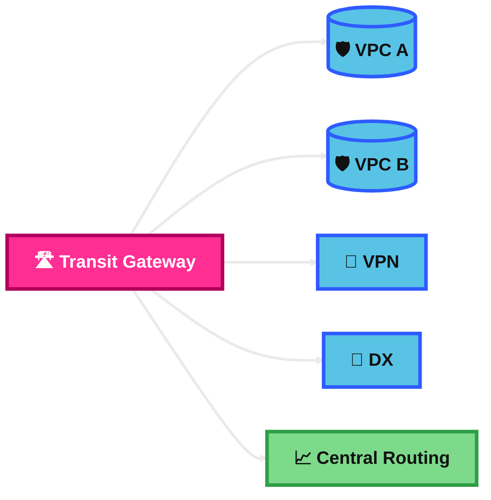
## VPC Traffic Mirroring

### What is it?
Traffic Mirroring copies traffic from an ENI to a monitoring target.

It is used for security inspection and troubleshooting.

### How it works?
You choose a source ENI, a target, and optional filters.

AWS sends a copy of the traffic to a monitoring appliance, such as an instance, Network Load Balancer target path, or Gateway Load Balancer path.

### Use Case
A security team wants to inspect packets by using an IDS or deep traffic analysis tool.

### Exam Tip
If the question says “copy traffic,” “deep packet inspection,” “intrusion detection,” or “analyze packets without changing production traffic,” think Traffic Mirroring.

Trap: VPC Flow Logs are for metadata only. Traffic Mirroring is for actual copied traffic analysis.

### Visual Mermaid
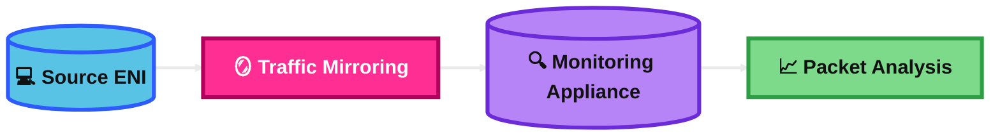
## Egress Only Internet Gateway

### What is it?
An Egress-Only Internet Gateway is outbound-only internet access for IPv6 traffic.

It is like the IPv6 version of a NAT-style outbound pattern.

### How it works?
You attach it to the VPC.

Then your route table sends IPv6 internet traffic (::/0) to the egress-only internet gateway.

Instances can start outbound IPv6 connections, but the internet cannot start inbound IPv6 connections to them.

### Use Case
Private IPv6-enabled instances need outbound internet access but must stay protected from unsolicited inbound internet traffic.

### Exam Tip
If the question specifically mentions IPv6 and outbound-only internet access, think Egress-Only Internet Gateway.

Trap: for IPv4 outbound-only internet access, use NAT Gateway, not egress-only IGW.

### Visual Mermaid
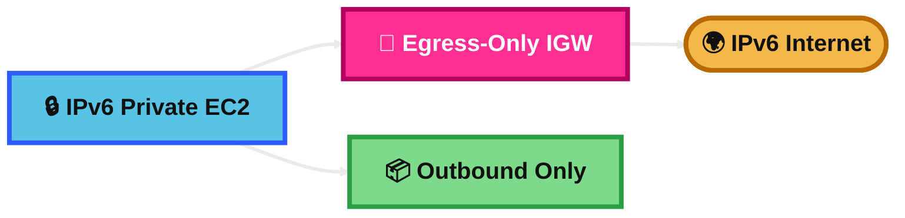
## AWS Network Firewall

### What is it?
AWS Network Firewall is a managed network security service for VPC traffic inspection.

It supports stateless and stateful filtering.

### How it works?
You create firewall policies and rule groups.

Traffic is sent through firewall endpoints, where AWS inspects packets and flows.

It can do deeper inspection than Security Groups or NACLs.

### Use Case
A company needs centralized inspection, domain or IP filtering, or deep packet inspection for VPC traffic.

### Exam Tip
If the question says “managed network firewall,” “central inspection,” “deep packet inspection,” or “stateful and stateless rules,” think AWS Network Firewall.

Trap: Security Groups and NACLs are simpler controls. Network Firewall is for stronger centralized inspection needs.

### Visual Mermaid
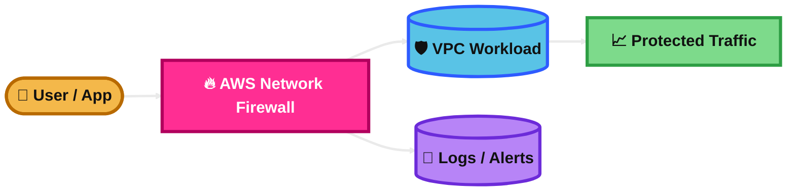
## AWS Networking Costs

### What is it?
AWS networking costs are the charges that come from moving traffic and using network services.

The exam often tests cost-aware design choices.

### How it works?
Common charges come from NAT Gateway hourly usage and per-GB processing, Transit Gateway attachments and data processing, Interface VPC endpoints, Direct Connect ports and data transfer, and Network Firewall endpoints and traffic inspection.

Some services can reduce cost. For example, S3 and DynamoDB gateway endpoints can avoid NAT Gateway data charges for that traffic.

### Use Case
A company uses private EC2 instances to access S3. Replacing NAT Gateway traffic with an S3 gateway endpoint can reduce cost.

### Exam Tip
Watch for phrases like “minimize cost,” “reduce NAT charges,” “avoid cross-AZ transfer,” and “many VPC attachments.”

Common traps:
- NAT Gateway costs can grow fast with heavy traffic.
- Cross-AZ traffic can add cost.
- Interface endpoints are not free.
- Transit Gateway is simpler at scale, but it is not free.

### Visual Mermaid
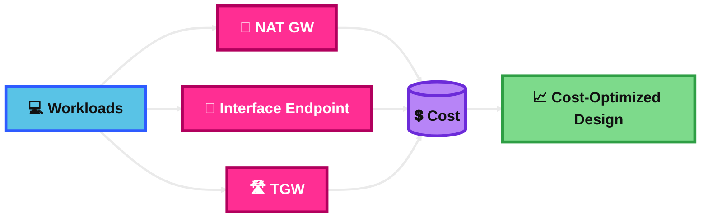
## Summary Table

| Topic | What It Is | How It Works | Best Use Case | Exam Trigger |
|---|---|---|---|---|
| AWS Virtual Private Cloud (VPC) | Private AWS network | CIDR, subnets, routes, gateways | Isolated app network | Logically isolated network |
| AWS Subnets | Smaller network inside VPC | CIDR split, one AZ each | Separate public and private tiers | Public vs private subnet |
| AWS Internet Gateway | VPC to internet path | Attach to VPC and route traffic to it | Public-facing EC2 or ALB | Internet-facing, public access |
| NAT Gateway and Internet Gateway | Outbound private access plus internet connectivity | Private subnets route to NAT, NAT routes through IGW | Private servers need updates or API access | Private subnet outbound only |
| Virtual Private Gateway (VPN) | AWS-side VPN endpoint for one VPC | VPN terminates on VGW | One VPC to on-prem over VPN | VPN endpoint on AWS side |
| NAT Instance | EC2-based NAT | Self-managed EC2 forwards traffic | Legacy or custom NAT need | Custom control, older option |
| AWS NAT Gateway | Managed NAT service | In public subnet, private subnets route to it | Outbound internet from private subnets | Managed, HA, outbound only |
| Stateless vs Stateful Firewalls | Connection-aware vs packet-only filtering | SG stateful, NACL stateless, Network Firewall can do both | Pick the right control type | Return traffic auto-allowed vs explicit rules |
| Network Access Control List (NACL) | Subnet firewall | Ordered allow/deny rules, stateless | Block IP ranges at subnet level | Explicit deny, subnet-level |
| VPC Peering | Private connection between two VPCs | Create peering and add routes | Simple one-to-one VPC connection | Connect two VPCs privately |
| VPC Endpoint | Private access to AWS services | Gateway or interface endpoint | Access S3 or AWS APIs without NAT/IGW | No internet, private AWS service access |
| VPC Flow Logs | Network traffic metadata logs | Log at VPC, subnet, or ENI | Troubleshoot accepted or rejected traffic | Analyze traffic flow |
| AWS Site-to-Site VPN | Encrypted hybrid connection over internet | Customer gateway to VGW or TGW with two tunnels | Fast hybrid setup | Encrypted internet-based hybrid link |
| Direct Connect (DX) and Direct Connect Gateway | Dedicated private hybrid connection | DX + VIF + DXGW to VPCs/TGW | Consistent private connectivity | Dedicated connection, hybrid, multiple VPCs |
| Transit Gateway | Central network hub | Attach VPCs, VPNs, DX | Many VPCs and hub-and-spoke | Large-scale multi-VPC routing |
| VPC Traffic Mirroring | Copies ENI traffic for inspection | Mirror source ENI to monitoring target | IDS, packet analysis | Deep packet inspection |
| Egress Only Internet Gateway | IPv6 outbound-only internet access | Route IPv6 outbound traffic through it | Private IPv6 workloads need internet out only | IPv6 outbound only |
| AWS Network Firewall | Managed network inspection firewall | Firewall policies, stateless and stateful rules | Centralized filtering and DPI | Managed firewall, deep inspection |
| AWS Networking Costs | Network-related AWS charges | Pay for traffic and network services used | Cost-optimized architecture | Minimize NAT, cross-AZ, endpoint, TGW cost |