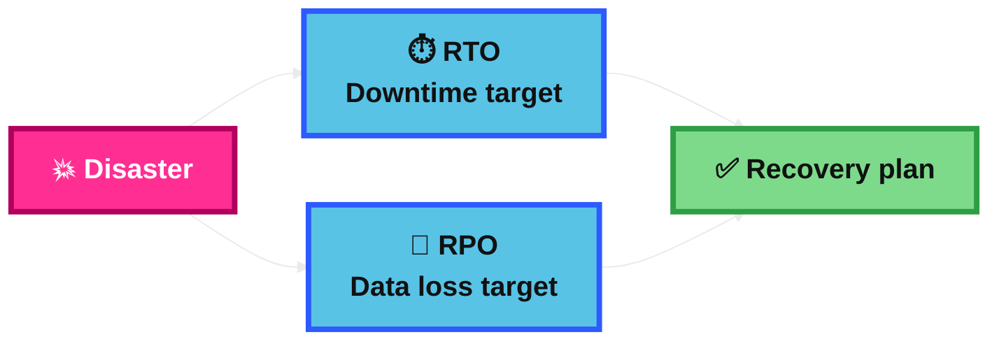
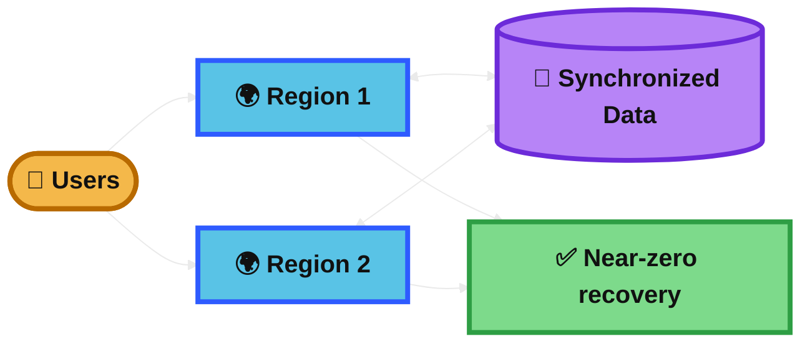
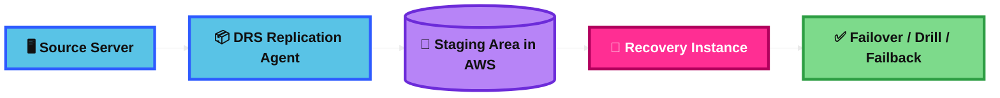
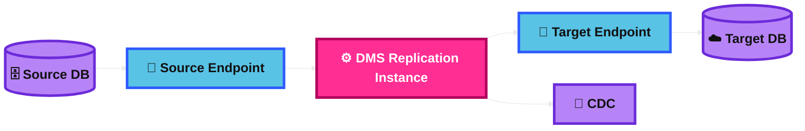
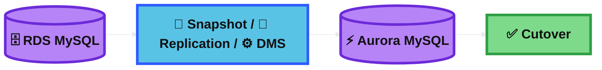
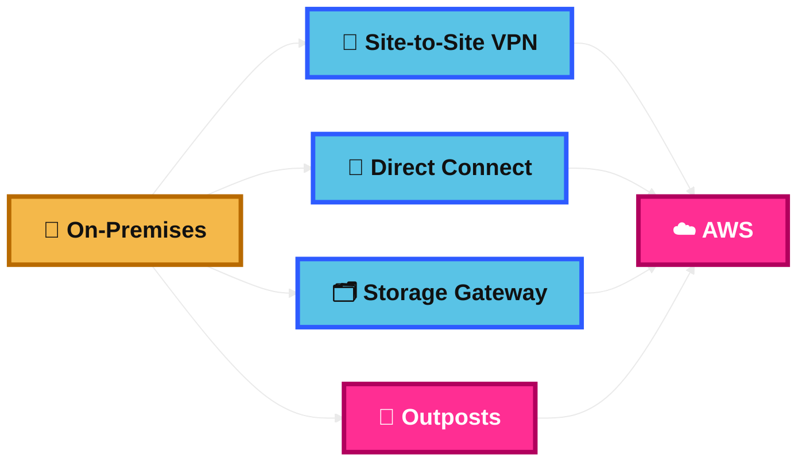
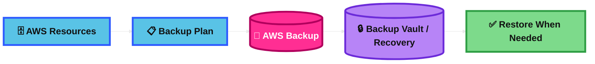
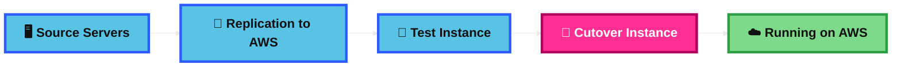
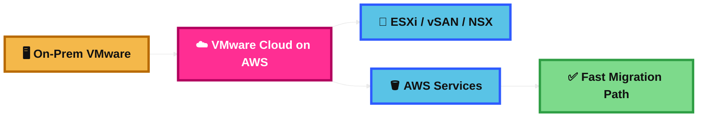

## RPO and RTO

### What is it?
RPO and RTO are business recovery targets.

RPO means how much data loss is acceptable, measured in time.

RTO means how long the system can stay down before it must be restored.

### How it works?
You decide the target first.

Then you choose a disaster recovery design that can meet that target.

Lower RPO and lower RTO usually mean higher cost and more complexity.

### Use Case
A payment app might need an RPO of 5 minutes and an RTO of 15 minutes.

That means the business can lose at most 5 minutes of data and tolerate at most 15 minutes of downtime.

### Exam Tip
If the question talks about data loss, think RPO.

If the question talks about downtime, think RTO.

Common trap: students mix them up.  
RPO = data loss target.  
RTO = recovery time target.

### Visual Mermaid

## AWS Pilot Light

### What is it?
Pilot Light is a disaster recovery strategy.

Only the most important core parts stay running in the recovery Region, such as data replication and backup-related resources.

The rest of the app is turned on only when a disaster happens.

### How it works?
You keep core data components ready in another Region.

If the primary Region fails, you launch or scale the missing app components and then send traffic there.

It is cheaper than Warm Standby because not everything is already running.

### Use Case
A company keeps its database and replicated storage ready in a second Region.

If disaster happens, it launches the web and app servers there and resumes service.

### Exam Tip
Look for clues like:
“core systems only,”
“lower cost DR,”
“data replicated already,”
“faster than backup and restore but slower than warm standby.”

Common trap: Pilot Light is not a fully running second environment.

### Visual Mermaid

```mermaid
%%{init: {'theme':'base','themeVariables': {
  'background':'#0B0F19',
  'primaryTextColor':'#111111',
  'secondaryTextColor':'#111111',
  'tertiaryTextColor':'#111111',
  'lineColor':'#EAEAEA',
  'fontSize':'20px'
}}}%%
flowchart LR
    A[🌍 Primary Region] --> B[(💾 Replicated Data)]
    B --> C[🔥 Core Services Always On]
    C --> D[🚀 Launch App Servers During DR]
    D --> E[✅ Recovery]

    classDef primary fill:#59C3E6,stroke:#2E5BFF,stroke-width:4px,color:#111111,font-weight:bold;
    classDef core fill:#FF2E93,stroke:#B1005D,stroke-width:4px,color:#FFFFFF,font-weight:bold;
    classDef data fill:#B784F7,stroke:#6C2BD9,stroke-width:4px,color:#111111,font-weight:bold;
    classDef out fill:#7DDA8B,stroke:#2E9E44,stroke-width:4px,color:#111111,font-weight:bold;

    class A,D primary;
    class C core;
    class B data;
    class E out;
```

## AWS Warm Standby

### What is it?
Warm Standby is a disaster recovery strategy where a scaled-down but fully working copy of the workload is already running in another Region.

It is more ready than Pilot Light.

### How it works?
The secondary Region has the full stack running, but with fewer resources.

Data is already replicated and live.

When disaster happens, you scale up quickly and route traffic to the standby environment.

### Use Case
An e-commerce app runs a smaller copy in another Region.

If the main Region fails, the standby Region scales up and takes production traffic fast.

### Exam Tip
Look for clues like:
“fully functional copy,”
“scaled-down environment,”
“always running,”
“RTO in minutes.”

Common trap: Warm Standby already has the app running. Pilot Light does not.

### Visual Mermaid

## Multi Site / Hot Site Approach

### What is it?
This is the most expensive and most ready disaster recovery style.

Multi-site active/active means the workload is deployed in multiple Regions and all Regions can serve traffic.

Hot Site or Hot Standby means the secondary Region has a full environment ready, but it usually does not serve traffic until failover.

### How it works?
You keep full infrastructure in more than one Region.

For active/active, users can be served from multiple Regions at the same time.

For hot standby, the second Region is fully ready and can take over very fast.

### Use Case
A global banking or trading platform needs near-zero downtime and very low data loss.

The business accepts higher cost to keep another Region fully ready.

### Exam Tip
Look for clues like:
“near-zero RTO,”
“very low RPO,”
“multi-Region,”
“highest availability,”
“highest cost.”

Common trap: active/active serves traffic from multiple Regions.  
Hot standby is usually active/passive.

### Visual Mermaid

## AWS Elastic Disaster Recovery (DRS)

### What is it?
AWS Elastic Disaster Recovery is a managed disaster recovery service for servers.

It helps recover on-premises or cloud-based servers into AWS with low downtime and low data loss.

### How it works?
You initialize DRS in a target AWS Region and install the replication agent on source servers.

DRS continuously performs block-level replication to a staging area in your AWS account.

During drills or real failover, DRS launches recovery instances in AWS. After recovery, you can fail back.

### Use Case
A company runs important VMs on-premises and wants AWS to be its recovery site.

If the data center fails, it can recover those servers in AWS.

### Exam Tip
Look for clues like:
“disaster recovery for servers,”
“replication agent,”
“staging area subnet,”
“drills,”
“failback.”

Common trap: DRS is for disaster recovery.  
It is not the best answer for one-time migration. For one-time lift-and-shift, think MGN.

### Visual Mermaid

## AWS DMS – Database Migration Service

### What is it?
AWS DMS is a managed service for moving databases and data stores.

It can handle one-time migrations or ongoing replication of changes.

### How it works?
You create source and target endpoints, a replication instance, and a replication task.

DMS reads data from the source, loads it into the target, and can continue capturing ongoing changes with CDC.

For heterogeneous migrations, schema conversion may also be needed.

### Use Case
A company migrates an on-premises Oracle database to Amazon RDS or Aurora with minimal downtime.

DMS can load the existing data and keep syncing changes until cutover.

### Exam Tip
Look for clues like:
“database migration,”
“minimal downtime,”
“CDC,”
“source endpoint and target endpoint,”
“replication instance.”

Common trap: DMS migrates databases, not application servers.  
For whole servers, think MGN.  
For schema differences, think schema conversion too.

### Visual Mermaid

## RDS MySQL to Aurora MySQL Migration

### What is it?
This is a database migration from Amazon RDS for MySQL to Amazon Aurora MySQL-Compatible Edition.

It is usually easier than a cross-engine migration because Aurora MySQL is MySQL-compatible.

### How it works?
You can migrate by restoring from an RDS MySQL snapshot into Aurora.

You can also use MySQL replication or AWS DMS to keep data in sync and reduce downtime before cutover.

Because the engines are compatible, schema conversion is usually much simpler than with heterogeneous migrations.

### Use Case
A company uses RDS MySQL but wants better scalability and Aurora features with minimal application changes.

It moves to Aurora MySQL and cuts over after synchronization.

### Exam Tip
Look for clues like:
“same MySQL family,”
“minimal code changes,”
“move from RDS MySQL to Aurora.”

Common trap: this is usually not a heavy schema-conversion project.

Another trap: Aurora MySQL supports InnoDB tables, so MyISAM-related issues can matter in migration questions.

### Visual Mermaid

## On-Premise strategy with AWS

### What is it?
This is a hybrid approach.

You keep some systems on-premises and connect, extend, or back them up using AWS services.

### How it works?
Use AWS Site-to-Site VPN when you want quick encrypted connectivity over the internet.

Use AWS Direct Connect when you want a dedicated private connection with more consistent network performance.

Use AWS Storage Gateway for hybrid storage, backup, and cloud-backed file or volume access.

Use AWS Outposts when workloads must stay on-premises for low latency or local data processing, but you still want AWS infrastructure and APIs.

### Use Case
A factory keeps latency-sensitive systems on-premises, backs up data to AWS, and connects its data center to VPCs in AWS.

### Exam Tip
Look for the real problem in the question.

If the problem is connectivity, think VPN or Direct Connect.

If the problem is hybrid storage, think Storage Gateway.

If the problem is local compute with AWS hardware and APIs on-premises, think Outposts.

Common trap: Direct Connect is not the same as Outposts.  
One is network connectivity. The other brings AWS infrastructure on-premises.

### Visual Mermaid

## AWS Backup

### What is it?
AWS Backup is a fully managed service for centralized and automated backups.

It helps protect data across AWS services, in the cloud, and on premises.

### How it works?
You create backup plans.

Those plans define things like schedule and retention period.

AWS Backup then applies and monitors backup policies from one place instead of managing backups service by service.

### Use Case
A company wants one central backup policy for multiple workloads instead of manually configuring each service separately.

### Exam Tip
Look for clues like:
“centralized backup,”
“automated backup policies,”
“retention rules,”
“single place to manage backups.”

Common trap: backup is not the same as high availability or near-zero RTO disaster recovery.

### Visual Mermaid

## AWS Application Migration Service (MGN)

### What is it?
AWS MGN is a managed lift-and-shift migration service for servers.

It helps move physical, virtual, or cloud servers into AWS with minimal changes.

### How it works?
You add source servers and replicate them into your AWS account.

Then you configure launch settings, launch test instances, and finally launch cutover instances in AWS.

MGN automatically converts and launches the replicated servers on AWS.

### Use Case
A company wants to move 200 on-premises VMware and physical servers to AWS quickly without redesigning the apps first.

### Exam Tip
Look for clues like:
“rehost,”
“lift and shift,”
“many servers,”
“test instance,”
“cutover instance.”

Common trap: MGN is for migration.  
DRS is for disaster recovery.

### Visual Mermaid

## VMware Cloud on AWS

### What is it?
VMware Cloud on AWS lets you run VMware environments on AWS infrastructure.

It is useful when a company already uses VMware heavily and wants a fast move to AWS with minimal change.

### How it works?
It runs the VMware stack on AWS infrastructure using familiar VMware technologies such as ESXi, vSAN, and NSX.

This helps teams move existing VMware workloads without redesigning them into cloud-native architectures first.

It can also connect to AWS services for storage, monitoring, and modernization over time.

### Use Case
A company with a large vSphere environment wants to move quickly to AWS but keep familiar VMware operations and tools.

### Exam Tip
Look for clues like:
“existing VMware investment,”
“keep vSphere tools,”
“fast migration,”
“minimal retraining,”
“minimal refactoring.”

Common trap: this is not the most cloud-native answer.  
If the question prefers managed AWS-native modernization, other AWS services may be better.

Real-world note: VMware Cloud on AWS continues to exist, but as of April 30, 2024 it is no longer resold by AWS or AWS channel partners.

### Visual Mermaid

## Summary Table

| Topic | What It Is | How It Works | Best Use Case | Exam Trigger |
|---|---|---|---|---|
| RPO and RTO | Recovery targets for data loss and downtime | Define targets first, then choose DR design | Any DR planning question | Data loss = RPO, downtime = RTO |
| AWS Pilot Light | Core DR components always on, rest launched during disaster | Keep data/core services ready, launch app tier when needed | Lower-cost DR with better recovery than backup/restore | Core systems only, lower cost, not fully running |
| AWS Warm Standby | Scaled-down but fully functional copy in another Region | Secondary stack is already running and scales up on failover | Faster recovery with moderate cost | Fully functional copy, always running, scale up |
| Multi Site / Hot Site Approach | Full multi-Region DR with highest readiness | Active/active serves traffic in multiple Regions, hot site is fully ready passive site | Near-zero recovery needs | Highest cost, highest complexity, multi-Region |
| AWS Elastic Disaster Recovery (DRS) | Managed DR for servers | Replication agent sends block-level data to AWS staging area, then recovery instances launch | DR for on-prem or cloud servers | Replication agent, staging area, drills, failback |
| AWS DMS | Managed database migration service | Uses endpoints, replication instance, tasks, full load and CDC | Database migration with minimal downtime | Database migration, CDC, source and target endpoints |
| RDS MySQL to Aurora MySQL Migration | MySQL-compatible database migration | Snapshot, replication, or DMS move data to Aurora | Move to Aurora with minimal app changes | Same engine family, minimal schema changes |
| On-Premise strategy with AWS | Hybrid architecture pattern | Use VPN, Direct Connect, Storage Gateway, or Outposts depending on need | Hybrid connectivity, storage, or local AWS compute | Connectivity vs storage vs local compute clue |
| AWS Backup | Centralized managed backup service | Backup plans define schedule and retention | One place to manage backups across workloads | Centralized backup, retention, compliance |
| AWS Application Migration Service (MGN) | Managed lift-and-shift server migration | Replicate servers, test, then cut over into AWS | Move many servers quickly with little redesign | Rehost, lift and shift, test instance, cutover |
| VMware Cloud on AWS | VMware environment on AWS infrastructure | Run VMware stack on AWS and keep familiar tools | Fast VMware migration with minimal refactor | Existing VMware investment, minimal retraining |