## AWS CloudFormation

### What is it?
AWS CloudFormation is Infrastructure as Code.

You define AWS resources in a template, and AWS creates them for you in the right order.

It helps you build repeatable, consistent environments.

### How it works?
You write a template in YAML or JSON.

The template becomes a stack.

CloudFormation creates, updates, or deletes the resources in that stack.

If an update fails, CloudFormation can roll back to the last working state.

### Use Case
A company wants the same VPC, subnets, EC2 instances, and security groups in dev, test, and prod.

CloudFormation lets them deploy the same setup again and again without manual work.

### Exam Tip
Look for clues like **repeatable infrastructure**, **version-controlled deployments**, **automated provisioning**, and **consistent environments**.

A common trap is choosing CloudFormation when the question is really about **application code deployment**. CloudFormation builds infrastructure, not the app release process itself.

### Visual Mermaid
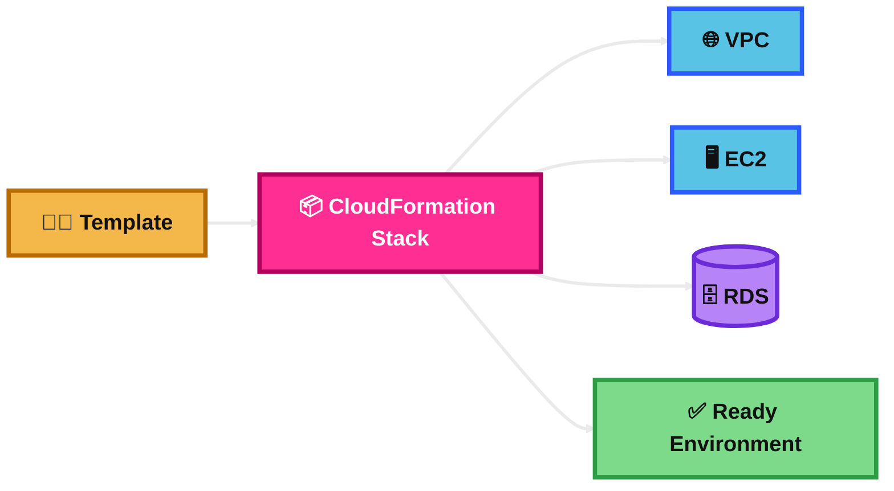
## Amazon Simple Email Service (Amazon SES)

### What is it?
Amazon SES is a managed email service.

It is mainly used to send and receive email at scale.

It is a common choice for transactional emails like password resets, receipts, and alerts.

### How it works?
Your application sends email through SES.

SES handles the email sending infrastructure for you.

You can send through SMTP or API.

You usually verify domains and set up DNS records like SPF, DKIM, and sometimes DMARC to improve deliverability.

### Use Case
An e-commerce app needs to send order confirmations and password reset emails.

SES is a simple, scalable, and low-cost option.

### Exam Tip
Look for clues like **transactional email**, **bulk email**, **receipt email**, **password reset**, and **managed email sending**.

A common trap is confusing SES with Amazon Pinpoint. **SES is mainly for sending email**, while **Pinpoint is for user engagement campaigns across multiple channels**.

### Visual Mermaid
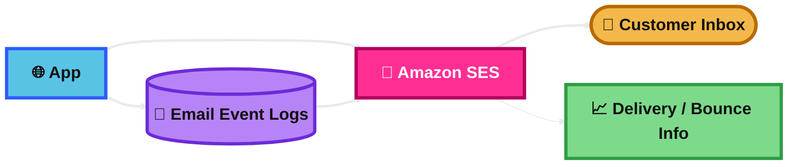
## Amazon Pinpoint

### What is it?
Amazon Pinpoint is a customer engagement service.

It helps businesses send targeted messages to users and measure engagement.

It is more about campaigns and communication strategy than simple email delivery.

### How it works?
You collect user data and build segments.

Then you send targeted messages, such as email, SMS, or push notifications.

Pinpoint tracks user responses and campaign performance.

### Use Case
A shopping app wants to send promo emails to inactive users and push notifications to users who left items in the cart.

Pinpoint helps target the right users and measure the campaign results.

### Exam Tip
Look for clues like **marketing campaign**, **user segmentation**, **targeted messaging**, **push notifications**, and **engagement analytics**.

A common trap is choosing Pinpoint for a basic password reset email. For that, **SES is usually the better answer**.

### Visual Mermaid
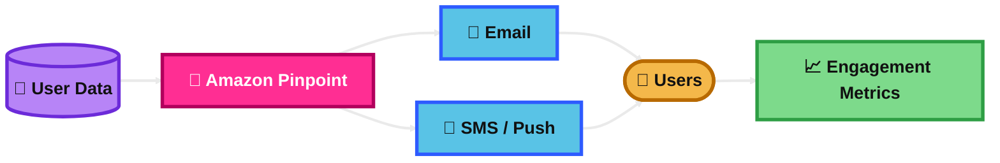
## AWS Systems Manager (SSM)

### What is it?
AWS Systems Manager helps you manage AWS resources and servers at scale.

It is useful for operations, patching, automation, parameter storage, and remote access.

It works for both EC2 instances and some on-premises servers.

### How it works?
You install or use the SSM Agent on managed instances.

Systems Manager communicates with the instances through IAM and the SSM service.

You can run commands, patch servers, open secure shell-like sessions, store secrets and config values, and automate routine tasks.

### Use Case
A company wants to patch hundreds of EC2 instances and connect to them without opening SSH port 22.

Systems Manager can do both.

### Exam Tip
Look for clues like **patching**, **Run Command**, **Session Manager**, **Parameter Store**, **automation**, and **manage servers without SSH or bastion host**.

A common trap is picking a bastion host when the question wants **secure access with less management overhead**. Session Manager is often the better answer.

### Visual Mermaid
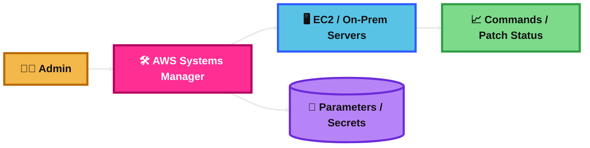
## AWS Cost Explorer

### What is it?
AWS Cost Explorer is a cost analysis tool.

It helps you view, filter, and understand AWS spending and usage over time.

It is useful for cost reporting and forecasting.

### How it works?
AWS collects billing and usage data.

Cost Explorer shows charts, trends, service-level costs, and forecasts.

You can filter by account, service, tag, region, or usage type.

### Use Case
A company wants to know why its EC2 costs increased last month.

Cost Explorer can break down the bill by service, region, and tag.

### Exam Tip
Look for clues like **analyze historical costs**, **forecast future spend**, **find which service caused the increase**, and **billing breakdown**.

A common trap is choosing Cost Explorer when the question is about **real-time unusual spend alerts**. That is a better fit for **Cost Anomaly Detection**.

### Visual Mermaid
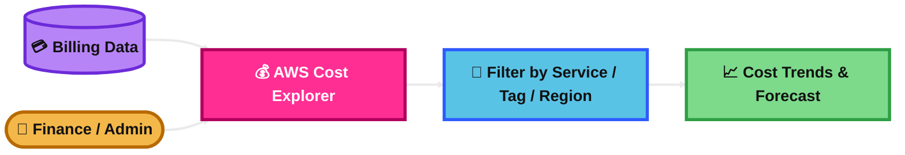
## AWS Cost Anomaly Detection

### What is it?
AWS Cost Anomaly Detection helps find unusual AWS spending.

It uses machine learning to spot cost spikes that do not match normal patterns.

It is mainly for proactive cost monitoring.

### How it works?
AWS monitors your usage and spending patterns.

If it detects something unusual, it sends an alert.

You can set monitors and notifications so teams know quickly when spend changes unexpectedly.

### Use Case
A developer accidentally launches expensive resources over the weekend.

Cost Anomaly Detection can alert the team before the monthly bill becomes a big surprise.

### Exam Tip
Look for clues like **unexpected cost spike**, **proactive detection**, **notify when spend becomes abnormal**, and **machine learning for billing anomalies**.

A common trap is choosing Cost Explorer when the question asks for **automatic detection and alerts**. Cost Explorer is for analysis. Cost Anomaly Detection is for unusual spend alerts.

### Visual Mermaid
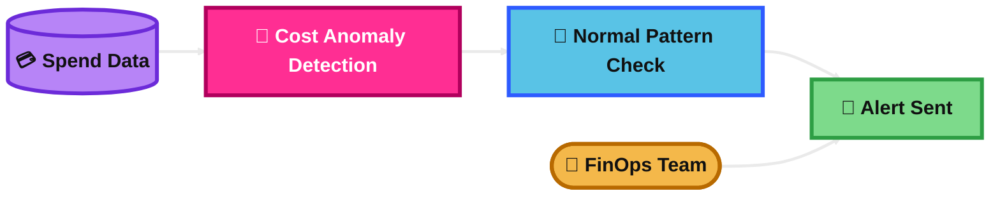
## AWS Outpost

### What is it?
AWS Outposts brings AWS infrastructure and services into your on-premises location.

It is useful when workloads need very low latency to local systems or must stay on site.

It gives a more consistent hybrid cloud experience.

### How it works?
AWS installs and manages AWS hardware in your data center or facility.

You run supported AWS services locally on that hardware.

The environment still connects back to an AWS Region for management and integration.

### Use Case
A factory has machines on site that need local processing with very low latency.

Outposts lets the company run AWS compute and storage close to those machines.

### Exam Tip
Look for clues like **run AWS services on premises**, **low latency to local equipment**, **local data processing**, and **hybrid with AWS APIs**.

A common trap is choosing Outposts for a simple migration to AWS. Outposts is for cases where workloads must stay close to the local environment.

### Visual Mermaid
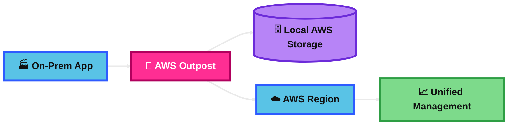
## AWS Batch

### What is it?
AWS Batch is a managed service for running batch jobs.

Batch jobs are tasks that can run later, in large numbers, and usually do not need immediate user response.

It removes much of the infrastructure work needed to run job queues.

### How it works?
You submit jobs to a job queue.

AWS Batch places them on compute resources based on the job definition and compute environment.

It can use EC2 or Fargate depending on the setup.

AWS Batch scales resources for the workload.

### Use Case
A research team needs to process thousands of image files overnight.

AWS Batch can queue the jobs, scale compute, and run them automatically.

### Exam Tip
Look for clues like **large-scale batch processing**, **job queues**, **scheduled compute jobs**, **containerized batch workloads**, and **no need for immediate response**.

A common trap is choosing Lambda for long or heavy batch jobs. Lambda is better for short event-driven tasks, not large batch workloads.

### Visual Mermaid
```mermaid
%%{init: {'theme':'base','themeVariables': {
  'background':'#0B0F19',
  'primaryTextColor':'#111111',
  'secondaryTextColor':'#111111',
  'tertiaryTextColor':'#111111',
  'lineColor':'#EAEAEA',
  'fontSize':'20px'
}}}%%
flowchart LR
    J[(📦 Batch Jobs)]:::data --> Q[📬 Job Queue]:::app
    Q --> B[⚙️ AWS Batch]:::core
    B --> C[🖥️ EC2 / Fargate Compute]:::app
    C --> O[📈 Results Output]:::dash

    classDef user fill:#F4B84A,stroke:#B86A00,stroke-width:4px,color:#111111,font-weight:bold;
    classDef app fill:#59C3E6,stroke:#2E5BFF,stroke-width:4px,color:#111111,font-weight:bold;
    classDef data fill:#B784F7,stroke:#6C2BD9,stroke-width:4px,color:#111111,font-weight:bold;
    classDef core fill:#FF2E93,stroke:#B1005D,stroke-width:4px,color:#FFFFFF,font-weight:bold;
    classDef dash fill:#7DDA8B,stroke:#2E9E44,stroke-width:4px,color:#111111,font-weight:bold;

    linkStyle 0,1,2,3 stroke:#EAEAEA,stroke-width:3px;
```
## AWS AppFlow

### What is it?
AWS AppFlow is a managed integration service.

It moves data between AWS services and SaaS applications without writing a lot of custom code.

It is useful for simple, secure data transfers.

### How it works?
You create a flow.

The flow pulls data from or pushes data to supported sources and destinations.

You can run flows on a schedule or when triggered.

It can also transform or filter data before delivery.

### Use Case
A business wants to move customer data from Salesforce into Amazon S3 every night for analytics.

AppFlow can handle that without building a custom integration.

### Exam Tip
Look for clues like **transfer data between SaaS and AWS**, **no-code or low-code integration**, **scheduled data movement**, and **managed data flow**.

A common trap is choosing AppFlow for real-time application messaging. AppFlow is mainly for data movement and integration, not event streaming.

### Visual Mermaid
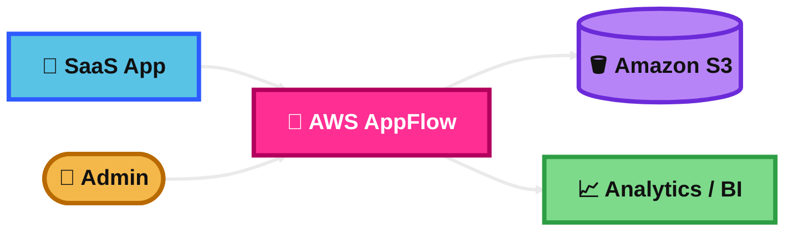
## AWS Amplify

### What is it?
AWS Amplify is a set of tools and services for building and hosting web and mobile applications.

It helps developers connect front-end apps to AWS back-end services more easily.

It is useful when speed of development matters.

### How it works?
You build a front-end app and connect it to services like authentication, APIs, storage, and hosting.

Amplify can help with CI/CD, front-end hosting, and integration with AWS back-end services.

It is designed to reduce setup work for developers.

### Use Case
A startup wants to launch a React web app with user sign-in, API access, and hosting fast.

Amplify can speed up the build and deployment process.

### Exam Tip
Look for clues like **quickly build and host web/mobile apps**, **front-end plus managed backend integration**, **authentication**, **API**, and **developer productivity**.

A common trap is choosing Amplify when the main problem is general infrastructure automation. Amplify is for app development experience, not broad infrastructure management like CloudFormation.

### Visual Mermaid
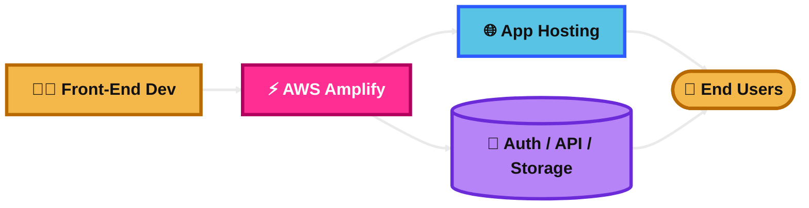
## AWS Instance Scheduler

### What is it?
AWS Instance Scheduler is used to start and stop resources on a schedule to save money.

It is commonly used for non-production environments that do not need to run all day.

Its main goal is cost optimization.

### How it works?
You define schedules for resources like EC2 instances.

The scheduler starts them when needed and stops them when not needed.

This reduces compute costs for workloads that only need to be available during certain hours.

### Use Case
A company wants its dev and test EC2 instances to run only during business hours.

The scheduler can shut them down at night and on weekends.

### Exam Tip
Look for clues like **save money by stopping instances after hours**, **business-hours scheduling**, and **non-production workloads**.

A common trap is choosing Instance Scheduler when the workload needs to **scale automatically based on traffic**. That is an Auto Scaling problem, not a scheduling problem.

### Visual Mermaid
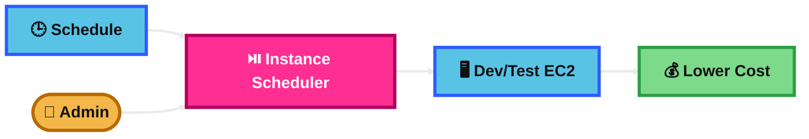
## AWS Well Architected Tool

### What is it?
AWS Well-Architected Tool helps review workloads against AWS best practices.

It is based on the Well-Architected Framework.

It helps teams improve architecture across areas like security, reliability, performance, cost, operational excellence, and sustainability.

### How it works?
You answer questions about your workload.

The tool checks your answers against best practices.

It then highlights risks and suggests improvements.

### Use Case
A team wants to review a production system before scaling it to more users.

The Well-Architected Tool helps find weak areas before problems happen.

### Exam Tip
Look for clues like **architecture review**, **best practices assessment**, **identify risks**, and **improve workload design**.

A common trap is thinking this tool automatically fixes your architecture. It gives guidance and findings, but the team still makes the changes.

### Visual Mermaid
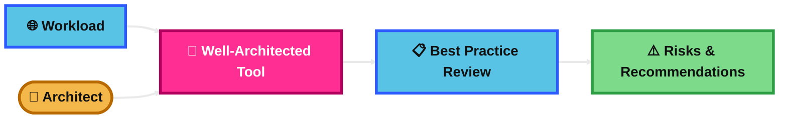
## AWS Trusted Advisor

### What is it?
AWS Trusted Advisor is a recommendation service for AWS environments.

It checks your AWS setup and suggests improvements.

It is commonly used for cost optimization, security, fault tolerance, performance, and service limit awareness.

### How it works?
Trusted Advisor reviews your AWS resources.

It looks for issues such as idle resources, open security groups, missing fault-tolerance settings, or service limit concerns.

Then it shows recommendations so you can improve the environment.

### Use Case
A team wants quick guidance on where it can reduce cost and improve security in its AWS account.

Trusted Advisor can point out underused resources and risky configurations.

### Exam Tip
Look for clues like **AWS recommendations**, **cost savings**, **security checks**, **fault tolerance improvements**, and **service limits**.

A common trap is confusing Trusted Advisor with the Well-Architected Tool. **Trusted Advisor checks your AWS environment for recommendations**, while **Well-Architected Tool reviews workload design against framework best practices**.

### Visual Mermaid
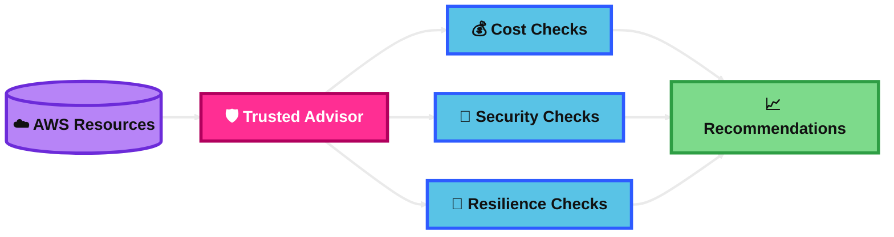
## Summary Table

| Topic | What It Is | How It Works | Best Use Case | Exam Trigger |
|---|---|---|---|---|
| AWS CloudFormation | Infrastructure as Code service | Uses templates to create and manage stacks of AWS resources | Repeatable environment setup | Same infrastructure, automation, version-controlled provisioning |
| Amazon SES | Managed email sending and receiving service | App sends email through SES API or SMTP | Password resets, receipts, alerts | Transactional email, bulk email, managed email delivery |
| Amazon Pinpoint | Customer engagement and campaign service | Segments users and sends targeted messages across channels | Marketing campaigns and user engagement | Segmentation, push notifications, campaign analytics |
| AWS Systems Manager (SSM) | Operations and server management service | Uses SSM Agent and IAM to run commands, patch, automate, and access instances | Manage EC2 or on-prem servers without heavy ops work | Patch management, Session Manager, no SSH or bastion |
| AWS Cost Explorer | Billing analysis and forecasting tool | Shows historical spend, trends, filters, and forecasts | Find which services are costing more | Analyze cost, billing trends, forecast spend |
| AWS Cost Anomaly Detection | Unusual spend detection tool | Uses ML to find abnormal AWS cost patterns and alert teams | Get warned about unexpected spending | Cost spike alert, abnormal spend, proactive cost monitoring |
| AWS Outpost | AWS infrastructure on premises | AWS-managed hardware runs supported AWS services locally and connects to Region | Low-latency hybrid workloads | AWS on-prem, local processing, hybrid architecture |
| AWS Batch | Managed batch computing service | Queues jobs and runs them on managed compute environments | Large-scale offline processing | Batch jobs, job queue, scheduled compute workloads |
| AWS AppFlow | Managed SaaS-to-AWS data integration service | Moves data between SaaS apps and AWS services using flows | Move Salesforce or other SaaS data to S3 | Managed data transfer, SaaS integration, no-code flow |
| AWS Amplify | Web and mobile app development platform | Connects front ends to hosting, auth, APIs, and storage | Quickly build and host modern apps | Front-end hosting, fast app development, managed backend integration |
| AWS Instance Scheduler | Cost-saving scheduling solution | Starts and stops instances on a defined schedule | Run dev/test only during work hours | Stop instances at night, business-hours scheduling, save cost |
| AWS Well Architected Tool | Workload review tool based on AWS best practices | Uses question-based review to identify risks and improvements | Architecture assessment before growth or redesign | Best practice review, workload risk assessment |
| AWS Trusted Advisor | AWS recommendation and checks service | Reviews resources for cost, security, resilience, and other issues | Improve AWS environment health quickly | Cost optimization, security checks, AWS recommendations |