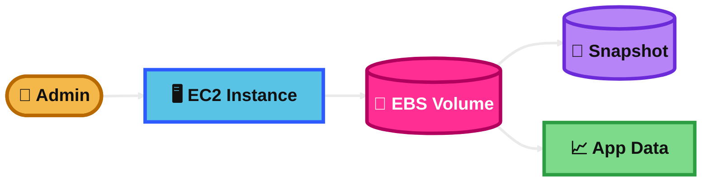
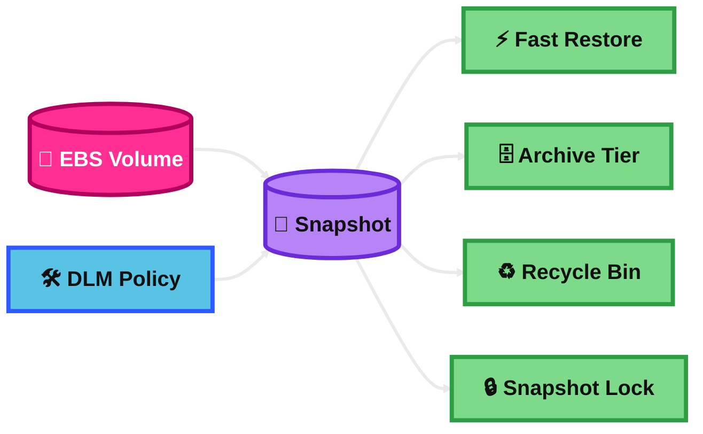
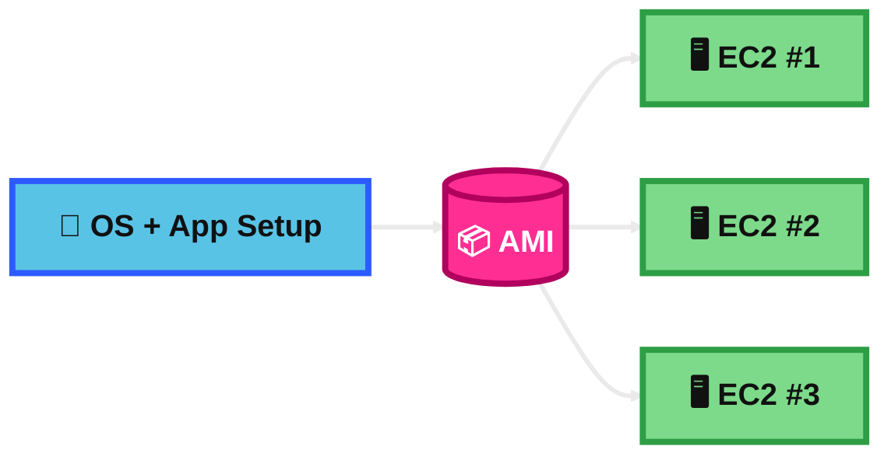
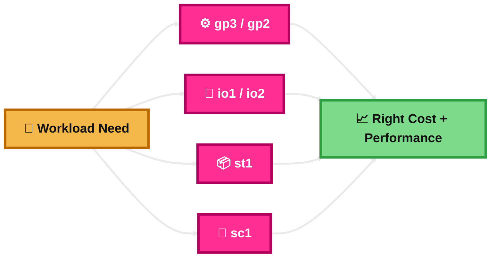
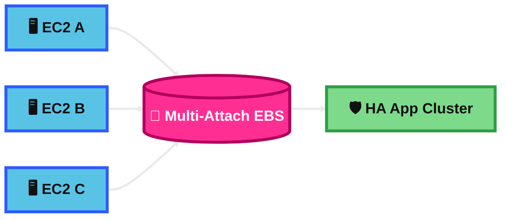
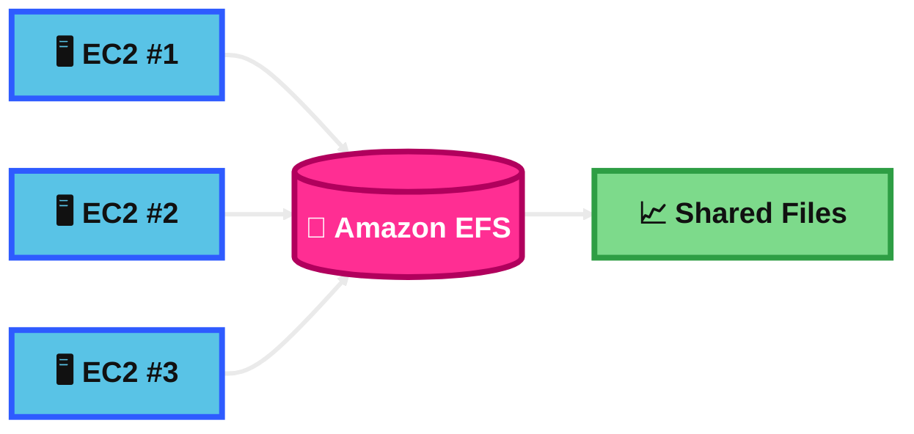
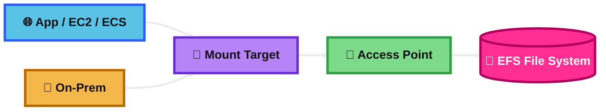
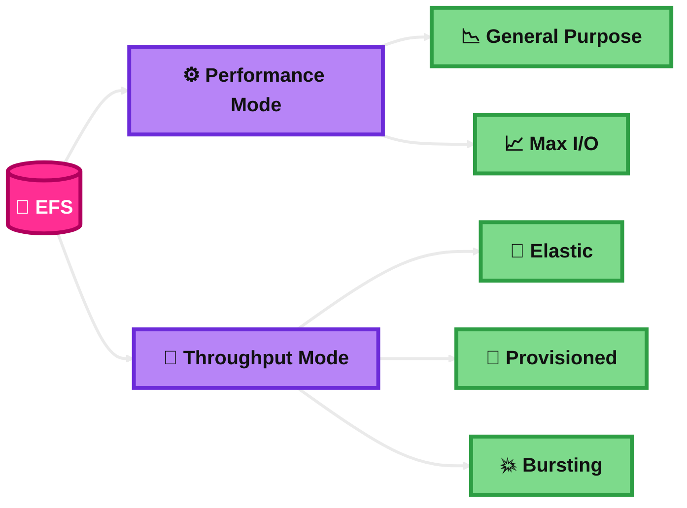
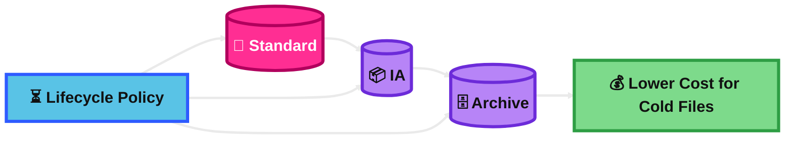
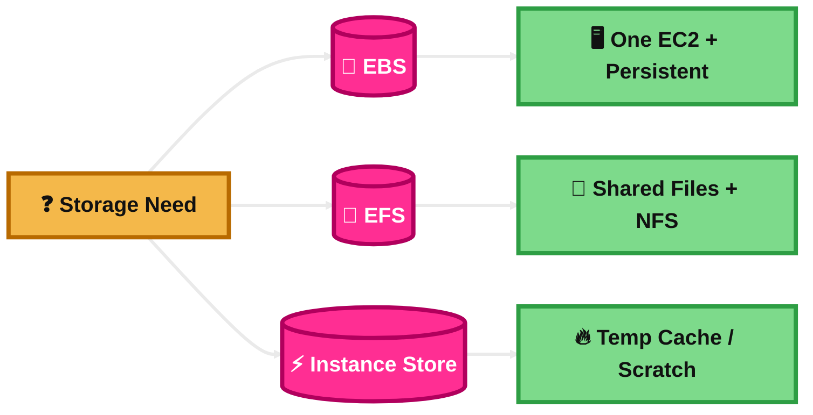

## Elastic Bloc Storage (EBS)

### What is it?

EBS is **block storage** for EC2.  
Think of it like a virtual hard drive for one server.

It is **persistent storage**, so the data stays even if you stop the instance.

### How it works?
You create an EBS volume in an **Availability Zone**.

Then you attach it to an EC2 instance in the **same AZ**.

The instance reads and writes blocks of data to that volume, just like using a disk.

You can also resize or tune some EBS volumes without rebuilding everything.

### Visual Mermaid

## EBS Snapshot

### What is it?
An EBS snapshot is a **point-in-time backup** of an EBS volume.

It is **incremental**, so after the first snapshot, AWS stores only changed blocks.

### How it works?
You take a snapshot of a volume.

Later, you can create a **new EBS volume** from that snapshot.

This is useful for backup, restore, migration, and disaster recovery.

### Visual Mermaid

## EBS Snapshot Features

### What is it?
These are extra snapshot capabilities that help with backup, recovery, retention, and compliance.

For the exam, the most useful features are **Fast Snapshot Restore**, **Snapshot Archive**, **Recycle Bin**, **Snapshot Lock**, and **automation with Data Lifecycle Manager**.

### How it works?
**Fast Snapshot Restore** makes restored volumes fully initialized right away.

**Snapshot Archive** is a lower-cost tier for long-term retention.

**Recycle Bin** helps recover deleted snapshots.

**Snapshot Lock** protects snapshots from deletion and can support WORM-style retention.

**Data Lifecycle Manager** automates snapshot creation, retention, archive, and some advanced settings.

### Visual Mermaid

## Amazon Machine Image (AMI)

### What is it?
An AMI is a **template** used to launch an EC2 instance.

It includes the software needed to boot the server, plus block device mapping.

### How it works?
You choose an AMI when launching EC2.

AWS uses that AMI to create the instance root volume and start the machine.

An AMI can be based on snapshots of the root volume.

### Visual Mermaid

## EBS Volume Types

### What is it?
EBS has different volume types for different workloads.

The main exam types are **gp3**, **gp2**, **io1/io2**, **st1**, and **sc1**.

### How it works?
**gp3** is the common default for general use.  
It gives a good balance of price and performance.

**gp2** is the older general-purpose SSD option.

**io1/io2** are for very high IOPS and critical workloads like databases.

**st1** is HDD for large, sequential throughput workloads.

**sc1** is cheaper HDD for cold, infrequently accessed data.

### Visual Mermaid

## EBS Multi-Attach

### What is it?
EBS Multi-Attach lets **one EBS volume** attach to **multiple EC2 instances** at the same time.

### How it works?
You enable Multi-Attach on a supported EBS volume.

That volume can then attach to multiple supported instances in the **same Availability Zone**.

All attached instances can read and write to the shared volume.

### Visual Mermaid

## Elastic File System (EFS)

### What is it?
EFS is a **managed NFS file system** for AWS.

It is designed for **shared file storage** and can be mounted by many compute resources.

### How it works?
You create an EFS file system.

Then you create **mount targets** in your VPC so clients can connect.

EC2 instances can mount it over **NFS** and share the same files.

EFS can scale automatically as files are added or removed.

### Visual Mermaid

## EFS Use Cases and Access

### What is it?
This topic is about **where EFS fits** and **how clients connect**.

EFS is best when many systems need the same file data.

### How it works?
Access happens through **mount targets** in the VPC.

You usually create mount targets across AZs for a Regional EFS file system.

Applications connect over **NFS port 2049**.

You can use **EFS Access Points** to give an app its own path and permissions.

EFS can also be reached from on-premises if network connectivity exists to the VPC, such as through Direct Connect.

### Visual Mermaid

## EFS Performance and Throughput Modes

### What is it?
EFS lets you choose **performance mode** and **throughput mode**.

These settings help balance latency, scale, and cost.

### How it works?
For **performance mode**, the key choices are:

**General Purpose** for low-latency workloads.  
**Max I/O** for very high scale and concurrency.

For **throughput mode**, the choices are:

**Elastic** when you want throughput to scale automatically with usage.  
**Provisioned** when you need a set throughput level.  
**Bursting** when throughput grows based on file system size and burst credits.

### Visual Mermaid

## EFS Storage Classes and Lifecycle Tiers

### What is it?
EFS has storage options to lower cost as files become less active.

The main ideas are **Regional vs One Zone** and **Standard vs IA vs Archive**.

### How it works?
**Regional** stores data across multiple AZs in a Region.  
This is the recommended option for higher resilience.

**One Zone** stores data in one AZ and is cheaper, but it has less resilience.

With lifecycle policies, files can move from **Standard** to **Infrequent Access (IA)** and then to **Archive** based on how long they have not been accessed.

When data in IA or Archive is written again, writes first go to **Standard**, then can move later.

### Visual Mermaid

## EBS vs EFS vs Instance Store

### What is it?
These are three very different EC2 storage answers.

This comparison is one of the most important SAA exam topics.

### How it works?
**EBS** is persistent **block storage** for EC2.  
Best for one instance disk, boot volumes, and databases.

**EFS** is managed **file storage** shared over NFS.  
Best when many Linux systems need the same files.

**Instance Store** is **temporary local block storage** physically attached to the host.  
It is very fast, but the data is lost if the instance is terminated or the host fails.

### Visual Mermaid

## Summary Table

| Topic | What It Is | How It Works | Best Use Case | Exam Trigger |
|---|---|---|---|---|
| Elastic Storage Block (ESB) | Really Amazon EBS, persistent block storage for EC2 | Create a volume in one AZ and attach it to EC2 in the same AZ | Boot volume, database disk, single-server storage | “Persistent disk for EC2” |
| EBS Snapshot | Point-in-time incremental backup of an EBS volume | Take snapshot, then restore a new volume later | Backup and recovery of EBS data | “Backup volume” / “restore later” |
| EBS Snapshot Features | Extra snapshot capabilities for recovery, automation, and compliance | Use FSR, Archive, Recycle Bin, Snapshot Lock, and DLM | Faster DR, long retention, protected backups | “Low RTO”, “recover deleted”, “automate retention”, “compliance lock” |
| Amazon Machine Image (AMI) | EC2 launch template image | Launch many identical EC2 instances from one image | Standardized server deployments | “Launch identical instances quickly” |
| EBS Volume Types | Different EBS disks for different workloads | Choose gp3/gp2, io1/io2, st1, or sc1 based on need | Match cost and performance to workload | “General SSD” = gp3, “high IOPS DB” = io2, “sequential HDD” = st1/sc1 |
| EBS Multi-Attach | One EBS volume attached to multiple EC2 instances | Use supported io1/io2 volume in same AZ | Special clustered shared block use | “Same volume to multiple EC2 in one AZ” |
| Elastic File System (EFS) | Managed shared NFS file storage | Mount from many clients through mount targets | Shared files for many Linux servers | “Shared file system”, “NFS”, “many EC2s” |
| EFS Use Cases and Access | How EFS is accessed and where it fits | Use mount targets, NFS, security groups, access points | Shared app data, containers, home directories | “Access point”, “POSIX”, “mount target”, “port 2049” |
| EFS Performance and Throughput Modes | EFS tuning choices for latency and throughput | Pick General Purpose or Max I/O, plus Elastic/Provisioned/Bursting throughput | Scale shared storage correctly | “Low latency” = GP, “huge parallel scale” = Max I/O, “unpredictable throughput” = Elastic |
| EFS Storage Classes and Lifecycle Tiers | Cost optimization for active vs cold files | Move files from Standard to IA/Archive with lifecycle rules | Shared files with aging data | “Shared storage + cheaper old files” |
| EBS vs EFS vs Instance Store | Core EC2 storage comparison | Choose by block vs file vs temporary local storage | Pick the right storage answer fast | “One EC2 persistent” = EBS, “shared files” = EFS, “temporary cache” = Instance Store |